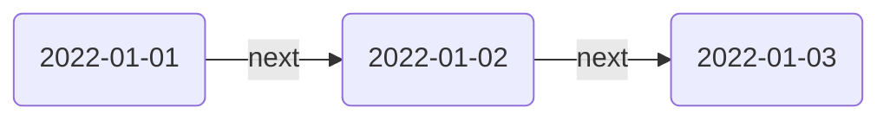
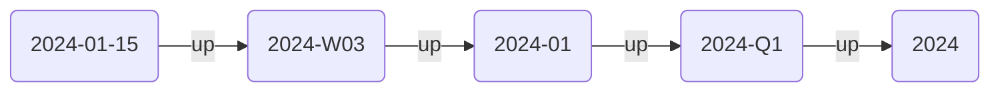

_Date Notes_ allow you to leverage your existing daily notes structure. You can enable Date Notes globally in the settings, under Date Notes. For example, Breadcrumbs can add edges from `2022-01-01` to `2022-01-02`, to `2022-01-03` using the [[Edge Fields|field]] you specify.

> [!TIP]
> Under the hood, Breadcrumbs takes the date of the current note and _adds one day_ to it. So the field you choose should reflect the "next" nature of this builder (as opposed to pointing to the date _before_ the current one).

## Settings

- **Enable**: Toggle Date Notes on or off
- **Field**: Choose the [[Edge Fields|field]] to use for the edges
- **Date Format**: Choose the date format you use for your daily notes (e.g. `YYYY-MM-DD`)
	- Refer to the [Luxon documentation](https://moment.github.io/luxon/#/parsing?id=table-of-tokens) for the full list of date formats
- **Stretch to Existing**: If there is a gap from one day to another, should the next note be the unresolved one in _one day_ or should it "stretch" to the next resolved (existing) note?

## Period Notes

In addition to daily edges, Date Notes can build a temporal hierarchy by connecting daily notes _up_ to their containing week, month, quarter, and year notes. Each period level is configured independently under **Settings → Date Notes → Period Notes**.

Each period level (Week, Month, Quarter, Year) has its own sub-section with the following settings:

- **Enabled**: Toggle this period level on or off
- **Date Format**: The [Luxon format](https://moment.github.io/luxon/#/formatting?id=table-of-tokens) matching the filename stem of your period notes

  | Period  | Default format      | Example filename |
  | ------- | ------------------- | ---------------- |
  | Week    | `kkkk-'W'WW`        | `2024-W03`       |
  | Month   | `yyyy-MM`           | `2024-03`        |
  | Quarter | `yyyy-'Q'q`         | `2024-Q1`        |
  | Year    | `yyyy`              | `2024`           |

- **Folder**: Vault folder containing the period notes. Leave empty to match notes anywhere in the vault.
- **Next Field**: The [[Edge Fields|field]] used for sequential edges _between_ period notes of the same level (e.g. `2024-W03` → `2024-W04`)
- **Up Field**: The [[Edge Fields|field]] used for containment edges from a child note _up_ to its period note (e.g. `2024-01-15` → `2024-W03`)

> [!TIP]
> Period levels are independent — you can enable only Month and Year if you don't use weekly or quarterly notes.
