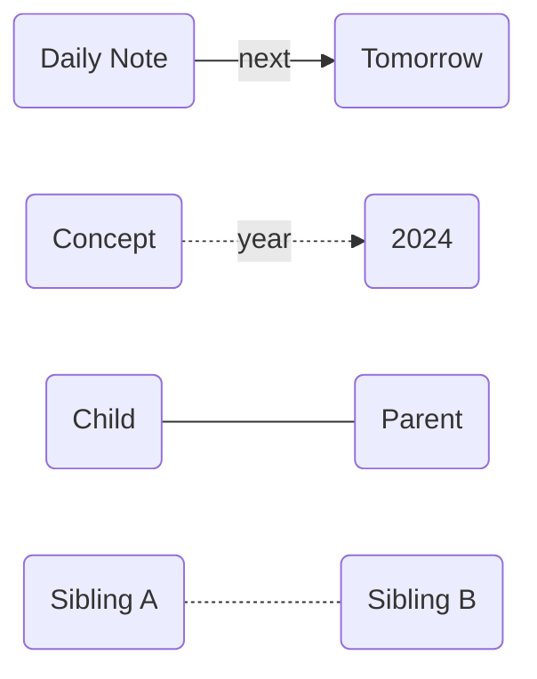
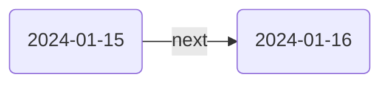
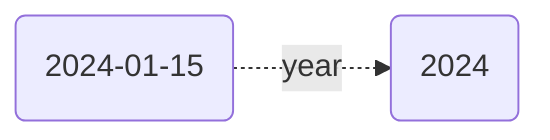
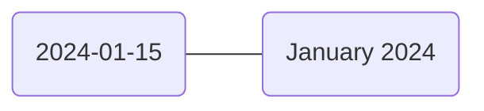
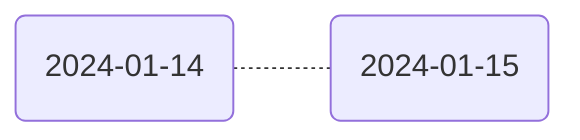
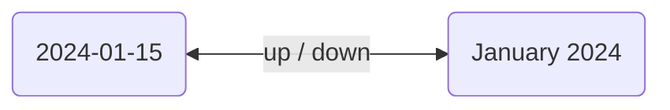
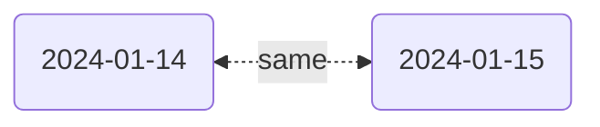

The [[Mermaid Codeblock]] view renders your Breadcrumbs graph as a flowchart, with every relationship between notes drawn as a connecting line. That line is not decoration — its style carries precise information. Every Mermaid arrow answers two questions simultaneously: was this edge written by a human, and does it run in one direction or both? The combination of these two answers produces one of four distinct styles.



> [!NOTE]
> This diagram is a reference legend. Each pair of nodes illustrates one arrow style in isolation. The sections below explain when each style appears and what it means.

## The Two Axes

The four styles come from two orthogonal properties. Understand the properties first and the lookup table that follows becomes obvious rather than arbitrary.

### 1. Solid vs Dashed — Provenance

A **solid line** means at least one edge on that line was explicitly written — as a [[../Explicit-Edge-Builders/Typed Links|typed link]] in frontmatter, a bullet in a [[../Explicit-Edge-Builders/List Notes|list note]], a folder structure in [[../Explicit-Edge-Builders/Folder Notes]], or any other [[../Explicit-Edge-Builders/Explicit Edge Builders|explicit edge builder]]. A human put it there.

A **dashed line** means every edge on that line was generated automatically by Breadcrumbs' [[../Implied-Edge-Builders/Implied Edge Builders|implied relations]] system — an opposite-direction rule, a transitive chain, or a sibling rule. No user ever declared it directly.

> [!TIP]
> Dashed lines are the most actionable signal in the diagram. If a dashed edge surprises you, a rule is firing that you may not have intended. Use `show-attributes: [source]` in a [[Codeblocks|codeblock]] to see exactly which rule generated it, then trace back to `Settings > Implied Relations` to review or adjust the rule.

### 2. Arrow vs No Arrow — Directionality

An **arrow** (`>`) means the edge exists in only one direction between this pair of notes. The relationship has a clear source and target.

**No arrowhead** means edges were found in _both_ directions between this pair and were folded onto a single line. Breadcrumbs omits the arrowhead in this case because adding one would be misleading — it would imply one note owns the relationship when in fact both sides hold a connection.

> [!TIP]
> An undirected line is not ambiguous — it is precise. The absence of an arrowhead is a deliberate signal: both directions exist and the diagram is not going to misrepresent which one matters more. No arrowhead means equal standing, not missing information.

> [!NOTE]
> Setting `mermaid-arrow: true` in a [[Codeblocks|breadcrumbs codeblock]] changes this behaviour. Undirected edges that would normally render as `---` or `-.-` instead receive arrowheads on both ends — `<--->` and `<.->` respectively. This makes the bidirectionality explicit in the diagram rather than implicit in the absence of an arrowhead. One-directional edges (`-->` and `-.->`) are unaffected.

## The Four Arrow Types

| Arrow | Mermaid syntax | Meaning |
|---|---|---|
| Solid, directed | `-->` | At least one explicit edge; relationship runs in one direction only |
| Dashed, directed | `-.->` | All edges are inferred; relationship runs in one direction only |
| Solid, undirected | `---` | At least one explicit edge; opposing edges were collapsed onto one line |
| Dashed, undirected | `-.-` | All edges are inferred; opposing edges were collapsed onto one line |
| Solid, bidirected (`mermaid-arrow: true`) | `<--->` | At least one explicit edge; opposing edges collapsed, arrowheads shown on both ends |
| Dashed, bidirected (`mermaid-arrow: true`) | `<.->` | All edges are inferred; opposing edges collapsed, arrowheads shown on both ends |

### `-->` Solid, Directed

At least one explicit edge exists between this pair, and no matching edge runs in the opposite direction.

**Example**: You add `next: "[[2024-01-16]]"` to `2024-01-15`. No implied rule is configured to generate a reverse `prev` edge. The relationship exists only in the forward direction — a solid arrow from `2024-01-15` to `2024-01-16`.



### `-.->` Dashed, Directed

Every edge on this line was generated by Breadcrumbs, and no matching edge runs in the opposite direction.

**Example**: A [[../Implied-Edge-Builders/Transitive Implied Relations|transitive rule]] `[up, up] → year` is configured. Breadcrumbs traverses two `up` hops — `2024-01-15` → `January 2024` → `2024` — and generates a direct implied `year` edge. No reverse rule creates a `2024 → 2024-01-15` edge, so the line is dashed and directed.



### `---` Solid, Undirected

Edges exist in both directions between this pair, and at least one of them was explicitly written.

**Example**: `2024-01-15` has `up: "[[January 2024]]"` in its frontmatter (explicit). The opposite-direction implied rule automatically creates a `down` edge from `January 2024` back to `2024-01-15` (implied). Both directions now exist. The pair collapses into a single solid undirected line — solid because the explicit `up` edge anchors it, undirected because the reverse also exists.



This is the most common arrow style in a well-configured vault. Every explicit `up` edge paired with its inferred `down` produces a `---` line.

### `-.-` Dashed, Undirected

Edges exist in both directions between this pair, and every one of them was generated by Breadcrumbs — no user declared any of them.

**Example**: A `same_field_sibling_of` implied rule generates a `same` edge from `2024-01-15` to `2024-01-14` (both are children of `January 2024`). The same rule generates the reverse edge. Both directions are implied and collapse into a dashed undirected line — the weakest signal in the diagram.



### `<--->` Solid, Bidirected

Produced when `mermaid-arrow: true` is set in the [[Codeblocks|codeblock]]. This is the `---` style with arrowheads restored on both ends. At least one explicit edge exists between this pair, and opposing edges were collapsed onto one line. The bidirected rendering makes it immediately visible that two directions are present rather than requiring the reader to know the "no arrowhead" convention.

**Example**: Same `up`/`down` pair as the `---` example above — `2024-01-15` has an explicit `up` to `January 2024` and an implied `down` runs in reverse. With `mermaid-arrow: true`, this renders as `<--->` instead of `---`.



### `<.->` Dashed, Bidirected

Produced when `mermaid-arrow: true` is set in the [[Codeblocks|codeblock]]. This is the `-.-` style with arrowheads restored on both ends. Every edge on this line was generated by Breadcrumbs — no user declared any of them — and opposing edges were collapsed. Like `<--->`, it makes the bidirectionality explicit in the rendered diagram.

**Example**: Same sibling pair as the `-.-` example above — two daily notes both children of `January 2024`, linked by a `same_field_sibling_of` rule in both directions. With `mermaid-arrow: true`, this renders as `<.->` instead of `-.-`.



## When Undirected Arrows Appear

The Mermaid codeblock always folds opposing edges onto a single line. Whenever Breadcrumbs finds edges running in both directions between the same pair of notes — whether explicit, implied, or a mixture — it draws one line instead of two crossing arrows. The solid-vs-dashed encoding then reflects the strongest edge among the collapsed set.

The most common trigger is the opposite-direction implied rule. When it is active for a field, every explicit edge you write automatically gains an inferred reverse, and the pair always appears as `---` in the Mermaid view. This is expected and healthy behaviour.

> [!NOTE]
> The [[Matrix View]] and [[Tree View]] show each direction as a separate entry and are not subject to this collapsing. If you need to inspect the individual directions of a relationship, use those views. The Mermaid view collapses opposing edges to keep diagrams readable.

If you see `---` or `-.-` lines and want to understand which specific edges were merged, add `show-attributes: [field]` to the codeblock:

````md
```breadcrumbs
type: mermaid
fields: [up, down]
show-attributes: [field]
```
````

The edge labels will include the field names of both the forward and backward edges, making the collapse visible in the diagram.

If you prefer arrowheads over the "no arrowhead" convention, add `mermaid-arrow: true` to the codeblock. All `---` lines become `<--->` and all `-.-` lines become `<.->`. The collapsing behaviour and the solid-vs-dashed encoding are unchanged — only the arrowhead rendering on those lines differs.

## Reading the Graph in Practice

**Solid vs dashed is the primary signal.** When an edge surprises you, check whether the line is dashed. Dashed means Breadcrumbs inferred it. Tracing back to the implied rule that created it will almost always explain why the edge appeared.

**Dashed undirected lines (`-.-`) deserve the most scrutiny.** They represent fully inferred, bidirectional relationships where no human declared anything on either side. If you see one that does not reflect your intent, a transitive or sibling rule is probably firing unexpectedly — check `Settings > Implied Relations > Transitive` and review whether your configured rules are scoped correctly. With `mermaid-arrow: true` these render as `<.->` instead, but carry the same meaning.

**Solid undirected (`---`) is the expected steady state.** It means you wrote an explicit edge and the implied system correctly added the reverse. If most of your graph shows `---`, your configuration is working as intended. With `mermaid-arrow: true` these same edges appear as `<--->` — the meaning is identical, only the rendering differs.

**Directed arrows (`-->` and `-.->`) mark one-way relationships.** This is by design for sequential fields like `next` — where a `prev` reverse is often not configured. A high count of directed arrows can also indicate that an opposite-direction implied rule is missing for a field you expected it to cover.

> [!TIP]
> To copy the raw Mermaid code that Breadcrumbs generated, use the copy icon in the top-left corner of the codeblock. Paste it into [mermaid.live](https://mermaid.live) to inspect the exact syntax of each edge and verify which arrow style was assigned.

## Next Steps

- [[Mermaid Codeblock]] — full reference for `fields`, `depth`, `show-attributes`, `merge-fields`, and layout options
- [[../Implied-Edge-Builders/Implied Edge Builders]] — the rules that produce the dashed edges in your graph
- [[../Implied-Edge-Builders/Transitive Implied Relations]] — configure and audit the multi-hop rules that are the most common source of unexpected dashed lines
- [[Vault Maintenance and Graph Auditing]] — broader guide on auditing explicit vs implied edges across your entire vault
- [[Freeze Crumbs to File]] — convert inferred (dashed) edges into explicit (solid) ones by writing them into your notes as typed links
