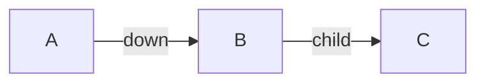

Breadcrumbs adds a new codeblock language, `breadcrumbs`. Currently, this can be used to render a tree of all paths in a given direction from the current note (similar to the [[Tree View]]), a [Mermaid](https://mermaid.js.org) graph, or a [Markmap](https://markmap.js.org) mind map of the same data. The codeblocks use **YAML**, for example:

```yaml
type: tree
fields: [down]
depth: [0, 3]
sort: basename asc
```

This would render a markdown list of all paths pointing _down_ from the current note, up to a depth of 3, sorted by the basename of the notes, in ascending order.

![[view.codeblock.tree.png]]

## Settings

Change under `Settings > Views > Codeblocks`:

- **Note Display Options**: Three toggles — **Folder**, **Extension**, and **Alias** — that control how note links are displayed across all codeblock results.

## Available Fields

The following fields can be added to the codeblock to customise the output. Below the heading name for each field, you'll see the possible values/options for that field, as well as it's default value in (parentheses). Optional fields are marked with a `?`. If you want to use the default value, then you don't need to add that field to the codeblock.

### `type`

```ts
type?: (tree) | mermaid | markmap
```

How to visualise the results.

- `tree` is similar to the [[Tree View]]
- `mermaid` renders the results in a [Mermaid](https://mermaid.js.org) graph
- `markmap` renders the results as an interactive [Markmap](https://markmap.js.org) mind map

![[Codeblock Mermaid Binary Tree.png]]

### `start-note`

```ts
start-note?: string
```

Override the starting note of the [[Concepts#Traversal|traversal]]. By default, the note that the codeblock is in will be used.

_Example_: `start-note: folder/note.md`

### `fields`

```ts
fields?: string[]
```

Filter edges by a list of your [[Edge Fields|edge fields]]. By default, all of your edge fields will be used.

_Example_: `fields: [up, same]`

### `field-groups`

```ts
field-groups?: string[]
```

Similar to the [[#`fields`]] property, but you can select multiple [[Field Groups|field groups]] instead of individual fields. By default, all fields (and therefore all groups) will be used.

_Example_: `field-groups: [ups, downs]`

### `merge-fields`

```ts
merge-fields?: (true) | false
```

If `false`, each of the chosen `fields` is [[Concepts#Traversal|traversed]] separately. If `merge-fields` is set to `true`, all fields will be traversed together, meaning paths of edges with different [[Edge Fields|fields]] will be shown together.

_Example_: `merge-fields: true`

> [!TIP]
> Another way to think of this is that `merge-fields: true` will run a _single_ traversal, where all fields are allowed in the path. Whereas `merge-fields: false` will run _multiple_ traversals - one for each field.

Consider the following graph:



Starting from node `A`, and `merge-fields: false`, the result would just be:

```markdown
- B
```

Because `A` doesn't have any `child` edges leaving it, so only the `down` traversal has results. But with `merge-fields: true`, the result would be:

```markdown
- B
  - C
```

Because the `down` and `child` edges are traversed together - paths with _either_ field are shown.

### `title`

```ts
title?: string
```

Add a title above the codeblock.

_Example_: `title: Breadcrumbs Codeblock`

### `depth`

```ts
depth?: [number] | [number, number]
```

Filter edges by a depth range. The min and max values are both _inclusive_.

_Example_:

- `depth: [0, 3]` - show all paths 3 levels deep and shallower
- `depth: [1, 3]` - show all paths between 1 and 3 levels deep
- `depth: [3]` - show all paths _atleast_ 3 levels deep

By default, all depths are shown.

### `collapse`

```ts
collapse?: true | (false)
```

If `type: tree`, and `collapse: true`, all nested lists will be collapsed/folded closed.

_Example_: `collapse: true`

### `content`

```ts
content?: open | closed
```

Controls whether the items in the codeblock result are rendered in an open or closed [HTML `<details>` element](https://developer.mozilla.org/en-US/docs/Web/HTML/Reference/Elements/details), allowing the whole block to be collapsed by the reader.

- `open`: The block is expandable, and starts expanded
- `closed`: The block is expandable, and starts collapsed

If omitted, no `<details>` wrapper is used and the content is always visible.

_Example_: `content: closed`

### `flat`

```ts
flat?: true | (false)
```

Flatten the tree results into a un-nested list.

_Example_: `flat: true`

### `dataview-from`

```ts
dataview-from?: string
```

Filter edges by a [Dataview](http://blacksmithgu.github.io/obsidian-dataview/) query.

_Example_: `dataview-from: '#tag and !"Folder"'`

### `show-attributes`

```ts
show-attributes?: EdgeAttribute[]
```

Show specific [[Concepts#Edge Attributes|edge attributes]] about each item in the result. By default, none are shown.

_Example_: `show-attributes: [field, source]`

### `field-prefix`

```ts
field-prefix?: true | (false)
```

When `show-attributes` includes `field`, prefix each item with the name of its [[Edge Fields|edge field]] rather than showing the field as a separate attribute column.

_Example_: `field-prefix: true`

### `sort`

```ts
sort?: <field> (asc) | desc
```

Order the results using a given [[Concepts#Edge Sorters|edge sorter]].

_Example_: `sort: basename`, or `sort: path desc`, or `sort: neighbour-field:next`

### `mermaid-direction`

```ts
mermaid-direction?: LR | RL | TB | BT
```

The [direction](https://mermaid.js.org/syntax/flowchart.html#direction) of the mermaid graph (if `type: mermaid`). Meaning:

- `LR`: Left-to-right
- `RL`: Right-to-left
- `TB`: Top-to-bottom
- `BT`: Bottom-to-top

_Example_: `mermaid-direction: TB`

### `mermaid-renderer`

```ts
mermaid-renderer?: (dagre) | elk
```

The [renderer](https://mermaid.js.org/syntax/flowchart.html#renderer) to use for the mermaid graph.

- `dagre` is the default, and is more stable.
- `elk` is more experimental, but can handle larger graphs.

_Example_: `mermaid-renderer: elk`

### `mermaid-curve`

```ts
mermaid-curve?: 
	| (basis)
	| bumpX
	| bumpY
	| cardinal
	| catmullRom
	| linear
	| monotoneX
	| monotoneY
	| natural
	| step
	| stepAfter
	| stepBefore
```

The [curve style](https://mermaid.js.org/syntax/flowchart.html#styling-line-curves) to use for the mermaid graph.

_Example_: `mermaid-curve: natural`

### `mermaid-arrow`

```ts
mermaid-arrow?: true | (false)
```

Controls whether bidirectional edges in the mermaid graph are rendered with arrowheads on both ends. Only applies when `type: mermaid`.

By default (`false`), edges that run in both directions between two notes are drawn as plain lines — either solid (`---`) or dashed (`-.-`) depending on whether the edges are [[Concepts#Explicit vs Implied Edges|explicit or implied]]. No arrowheads appear on either end, which keeps the diagram cleaner when reciprocal relationships are already understood.

When set to `true`, those same bidirectional edges gain arrowheads on both ends (`<--->` for explicit, `<.->` for implied), making the two-way nature of the relationship explicit in the diagram.

One-directional edges are unaffected — they always render as `-->` (explicit) or `-.->` (implied) regardless of this setting.

> [!EXAMPLE]
> Suppose your vault has a `parent`/`child` implied-relation pair, so an explicit `up` edge from `2024-01-15` to `January 2024` also generates an implied `down` edge back. In the mermaid graph:
>
> - `mermaid-arrow: false` — the two notes are connected by a plain line (`-.-`) with no arrowheads, since the relationship is bidirectional and implied.
> - `mermaid-arrow: true` — the connector becomes `<.->`, showing arrowheads on both ends so the direction of each relationship is visible.

> [!TIP]
> Use `mermaid-arrow: true` when sharing a graph with someone unfamiliar with your vault structure, or when the direction of implied edges matters for understanding (e.g., a `reports-to` hierarchy where both the explicit and implied edges carry meaning).

_Example_: `mermaid-arrow: true`

## Examples

### Simulate the Matrix View

You can show similar results to the [[Matrix View]] using the following codeblock:

```yaml
type: tree
# Only show the top-level edges
depth: [0, 0]
# Show the `field` attribute next to each edge item
show-attributes: [field]
# Sort the results by their field name, effectively "grouping" by field
sort: field
```

![[Codeblock Matrix View.png]]
