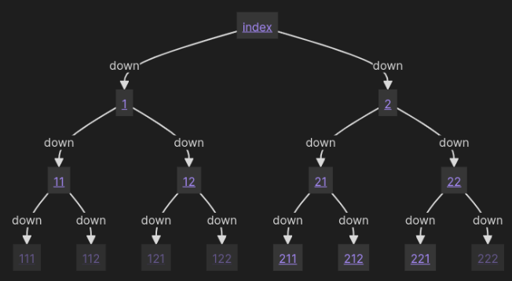

🍞 **Breadcrumbs** updates, in reverse-chronological order:

- Hierarchy Field Suggestor, to quickly add Breadcrumbs fields to your notes (disabled by default) ⏩
- The various `BC-...` metadata fields (and their data-types) are now auto-completed in Properties, even if you haven't used them before. Same goes for your hierarchy fields ℹ️
- Manually ignore notes from the BC graph using the `BC-ignore-in-edges` and `BC-ignore-out-edges` boolean fields 🚫
- Option to hide the Trail View controls at the top of a note (they're still shown by default) :carlhide:
- BC links now work much more like regular Obsidian links. Right-click context-menu, ctrl-clicking, hover-preview, etc. 🔗
- Mermaid codeblocks! These work exactly like the default `type: tree` codeblocks, except they render the nested-list as a [Mermaid](<https://mermaid.js.org/> "Mermaid
(<https://mermaid.js.org/>)") graph (image attached) 🧜✨

These updates are currently only available in the V4 beta via the BRAT plugin. Let me know your thoughts, I'm always looking for feedback, especially as the beta gets closer to being stable! All changes are documented in the [README](https://github.com/SkepticMystic/breadcrumbs), if you've got any questions, please do ask in ⁠breadcrumbs. Thank you to everyone that helped suggest/test these changes 💚

---

Message Link: [Discord](https://discord.com/channels/686053708261228577/855181471643861002/1226248518578995230)
