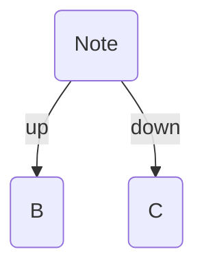

This command takes all the [implied edges](/implied-edge-builders/) leaving the current note, and makes them explicit by writing them to the file in the format you choose.

For example, if the current note has some implied edges pointing to other notes:


You can run the **Freeze implied edges to note** command to turn them into [explicit](/explicit-edge-builders/) [typed-links](/explicit-edge-builders/typed-links/):

**Note.md**:

```md
---
up: "[[B]]"
down: "[[C]]"
---

... content of Note.md
```



## Settings

- **Destination**: Choose where to write the edges to. Either as [frontmatter links](/explicit-edge-builders/typed-links/#frontmatter-links) or [Dataview links](/explicit-edge-builders/typed-links/#inline-fields)
