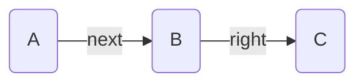

---
aliases:
  - Reference
title: Concepts
---

This page defines various concepts used across Breadcrumbs

## Graph

Breadcrumbs uses a graph data-structure to represent the links in your notes. This is very similar to the vanilla Obsidian graph, except now, edges have _types_ to them (these are stored in the [Edge Attributes](#edge-attributes)).

> [!EXAMPLE]
> A common use-case of graphs is representing personal-connections in a social network. Each person is represented as a _node_ in the graph, and connections between people (e.g. friendship) are represented as _edges_.

[Mermaid](https://mermaid.js.org) is used to visualisation graphs in a few places across Breadcrumbs, mainly in [Codeblocks](/views/codeblocks/). A simple example of a graph is:

## Node Attributes

Each node in the Breadcrumbs [Graph](#graph) represents a note in your Obsidian vault. They have the following attributes:

- `resolved`: Whether the note is resolved or not (exists as a markdown file). An _unresolved_ node is referenced in an edge but has no corresponding `.md` file in the vault. Some builders (e.g. [date_note](/explicit-edge-builders/date-notes/)'s "stretch to existing" option) behave differently for unresolved nodes.
- `aliases`: Any aliases of the note, used for display purposes

## Edge Attributes

Edges in the Breadcrumbs [Graph](#graph) represent links between nodes (notes). These are _similar_ to Obsidian links, but can be created using other methods as well, not just `[[wikilinks]]`. Each edge has a few attributes:

- `field`: Which [edge field](/edge-fields/) was used
- `explicit`: Whether the edge is [explicit](explicit-edge-builders/) or [implied](/implied-edge-builders/implied-edge-builders/)
- `source`: If the edge is explicit, which [edge builder](/explicit-edge-builders/) added it
- `implied_kind`: If the edge is implied, which [implied rule](/implied-edge-builders/implied-edge-builders/) added it
- `round`: If the edge is implied, which [round](/implied-edge-builders/implied-relation-rounds/) was it added in

## Edge Sorters

Various Breadcrumbs functions let you sort a list of (potentially nested) edges. The available fields to sort by include:

- `basename`: sorts by the basename of the target note
- `basename_natural`: sorts by basename using _natural sort order_, so that numbered notes sort as `note-2`, `note-10` rather than `note-10`, `note-2`
- `path`: sorts by the full path of the target note
- `path_natural`: same as `path`, but using natural sort order
- `field`: sorts by the [field](/edge-fields/) of the edge
- `explicit`: sorts by the explicitness of the edge — explicit edges sort before implied edges
  - Uses `source` as a tiebreaker for [explicit](/explicit-edge-builders/) edges, and `implied_kind` for [implied](/implied-edge-builders/implied-edge-builders/) edges

There are more complex sort fields as well:

- `neighbour-field:<field>` sort by the _path_ of the first neighbour of the note in the given [edge field](/edge-fields/).
  - Useful for sorting by the `next` neighbour.

## Traversal

A _graph traversal_ is a systematic way to visit each node in a [Graph](#graph). There are different strategies you can use, just like there are different routes you could take through a city grid. Two common strategies are:

- _Depth-first search_, which is like starting at your house and going down the first street you see, then exploring every little side street and alley off of that street before you go back and try the next street.
- _Breadth-first search_ is like checking out all the streets immediately around your house first, then moving out to the next layer of streets, and so on.

So in short, a graph traversal is a way to explore all parts of a connected structure, like a city map, in a systematic and efficient way.

Applied to Breadcrumbs, many of the [Views](/views/) run a traversal - starting from the currently active note - and find all paths going outwards. Often, the resulting paths are filtered, such that they meet some criteria (usually that every edge in the path has a given [field](/edge-fields/) attribute).

## Edge Field Groups

An _edge field group_ is a named collection of [edge fields](/edge-fields/) used to filter which edges are considered by a view or command. Rather than specifying individual fields each time, you define a group once and reference it by name.

> [!EXAMPLE]
> A group called `"ups"` might contain the fields `up`, `parent`, and `broader`. Any view configured to use the `"ups"` group will traverse only those three fields.

See [Field Groups](field-groups/) for configuration details. Field groups are used throughout the [Views](/views/) settings to control traversal scope.

## Implied Relation Rounds

When Breadcrumbs generates [implied edges](/implied-edge-builders/implied-edge-builders/), it runs in numbered _rounds_. Explicit edges are treated as round `0`. In each subsequent round, the implied relation engine reads the edges produced so far and applies transitive rules to generate new edges, incrementing the round number.

This matters because an edge implied in round 1 can itself seed a new implication in round 2 — enabling deep chains (e.g. parent → grandparent → great-grandparent) to be built up iteratively. The `round` attribute on each implied edge records which pass produced it.

> [!INFO]
> The maximum number of rounds is capped at 10.

## Transitive Implied Relations

A _transitive implied relation_ is a rule that chains a sequence of edge fields together to infer a new edge. Each rule has:

- `chain`: the ordered list of [fields](/edge-fields/) to traverse (e.g. `[up, up]`)
- `close_field`: the field to assign to the newly implied edge (e.g. `grandparent`)
- `close_reversed`: when `true`, the implied edge points from the _end_ node back to the _start_ node instead of start → end
- `rounds`: how many [rounds](#implied-relation-rounds) to run the rule

> [!EXAMPLE]
> A rule with `chain: [up, up]` and `close_field: grandparent` means: if A →[up]→ B and B →[up]→ C, then imply A →[grandparent]→ C.

Transitive rules are configured in Settings → Implied Relations → Transitive.

## Show Node Options

_Show node options_ control how note names are displayed in [Views](/views/) and [Codeblocks](/views/codeblocks/). Three toggles are available:

- `ext`: show the file extension (e.g. `note.md` instead of `note`)
- `folder`: show the folder path prefix (e.g. `Projects/note`)
- `alias`: use the note's alias instead of its basename, when one is set

These options appear in the settings for every view (Trail, Prev-Next, Matrix, Tree, Codeblocks).

## Lock View

The [Matrix View](/views/matrix-view/) and [Tree View](/views/tree-view/) can be _locked_ to a specific note path. When locked, the view does not update as you navigate between notes — it stays pinned to the note it was locked on. This is useful when you want to keep a reference hierarchy visible while browsing elsewhere in the vault.

## Find Root

The [Tree View](/views/tree-view/) has a _find root_ option. When enabled, instead of starting the traversal from the currently active note, Breadcrumbs first traverses _upward_ (using a configured set of [[Edge Field Groups|field groups]], defaulting to `"ups"`) to find the root ancestor, then renders the full tree downward from there.

> [!EXAMPLE]
> If you're on `2024-01-15` and find root is enabled with the `"ups"` group, the tree will show the full year/month/week/day hierarchy rooted at `2024`, not just the subtree below `2024-01-15`.

## Crumb Destination

A _crumb destination_ controls where Breadcrumbs writes links back into your notes when using commands like [Freeze Implied Edges](/commands/freeze-crumbs-to-file/) or [Threading](/commands/threading/). Two options are available:

- `frontmatter`: writes links as a YAML frontmatter property (e.g. `up: [[note]]`)
- `dataview-inline`: writes links as a Dataview inline field (e.g. `up:: [[note]]`)
