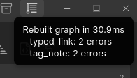
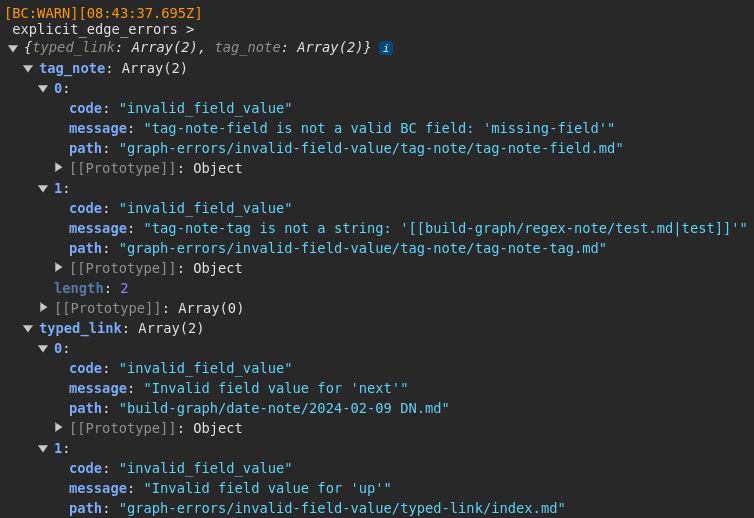

## Log Levels

Breadcrumbs lets you choose a _log level_ in the settings (under `Settings > Debug`), to determine which console logs you want to be shown, and which to hide. In increasing order of importance:

- **DEBUG**: In-depth logs
- **INFO**: Not critical, but fewer than DEBUG
- **WARN**: Notifies of problems that can be recovered from
- **ERROR**: Unrecoverable errors
- **FEAT**: Some features exist specifically to log to the console (e.g. the [graph stats command](/commands/graph-stats/))

By default, all logs with the **INFO** level and higher will be shown.

## Edge Build Errors

When you [rebuild the graph](/commands/rebuild-graph/), it's possible the setup is invalid, so Breadcrumbs will warn you about these issues:

You can open the console (press `Ctrl + Shift + I`) to see a full, detailed list of the issues found:

