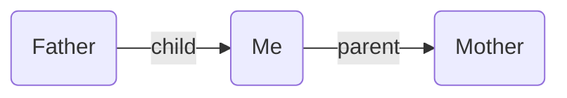

---
aliases:
  - edge fields
  - field
title: Edge Fields
description: How to define and use typed edge fields to add directional relationships between notes in Breadcrumbs.
---

The starting point of Breadcrumbs is _fields_, which let you add _types_ to your links. For example, the `[[Father]]` note could have a `child` field pointing to `[[Me]]`, and `[[Me]]` could have a `parent` field pointing to `[[Mother]]`:

**Father.md**

```md
---
child: "[[Me]]"
---
```

**Me.md**

```md
---
parent: "[[Mother]]"
---

<!-- Works with Dataview inline fields, too -->

parent:: [[Mother]]
```

This would result in the following [graph](/concepts/#graph):



---

By default, there will be 5 starting fields: `up`, `same`, `down`, `next`, and `prev`, representing 5 different directions. These can take you quite far, and you may be happy using just these fields, but you can customise them further. To get started, you need to tell Breadcrumbs which other fields you intend to use to "type" your links. This can be done under `Settings > Edge Fields`:


For example, you can [model personal relationships](/guides/personal-relationship-management/) using fields like `parent`, `child`, and `sibling`. Or you can create a [layered system of daily notes](/guides/layered-daily-notes/) using fields like `day`, `month`, and `year`.

## Mermaid Arrow Style

Each edge field has an optional **Mermaid arrow shape** setting, available in `Settings → Edge Fields` as a dropdown next to the field label. This controls how that field's edges appear when rendered in a [Mermaid codeblock](/views/codeblocks/).

Available shapes:

| Value | Description |
|-------|-------------|
| _(default)_ | Use the codeblock's default arrow logic |
| `-->` | Solid arrow |
| `---` | Solid line, no arrowhead |
| `==>` | Thick arrow |
| `===` | Thick line, no arrowhead |
| `-.->` | Dotted arrow |
| `-.-` | Dotted line, no arrowhead |
| `--o` | Circle endpoint |
| `--x` | Cross endpoint |

When two edges between the same pair of notes share the **same** custom arrow on both directions, they collapse into a single bidirectional line (e.g. `==>` becomes `<==>`). When they differ, each renders as a separate one-way line.

Fields without a custom arrow keep the existing default behaviour (solid `-->` / dotted `-.->` based on explicit vs implied, with optional arrowheads via the [`mermaid-arrow`](/views/codeblocks/#mermaid-arrow) codeblock option).
