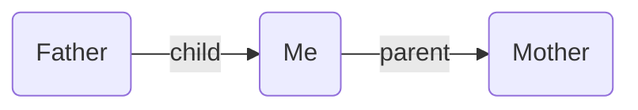
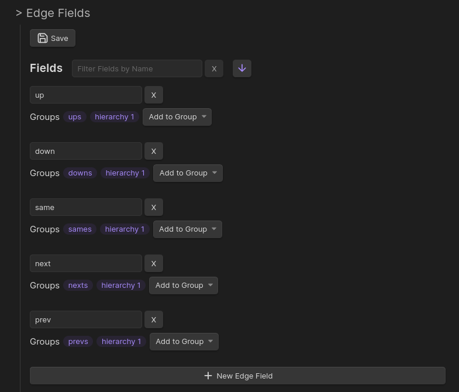

---
aliases:
  - edge fields
  - field
title: Edge Fields
description: How to define and use typed edge fields to add directional relationships between notes in Breadcrumbs.
---

The starting point of Breadcrumbs is _fields_, which let you add _types_ to your links. For example, the `[[Father]]` note could have a `child` field pointing to `[[Me]]`, and `[[Me]]` could have a `parent` field pointing to `[[Mother]]`:

**Father.md**

```md
---
child: "[[Me]]"
---
```

**Me.md**

```md
---
parent: "[[Mother]]"
---

<!-- Works with Dataview inline fields, too -->

parent:: [[Mother]]
```

This would result in the following [graph](/concepts/#graph):



---

By default, there will be 5 starting fields: `up`, `same`, `down`, `next`, and `prev`, representing 5 different directions. These can take you quite far, and you may be happy using just these fields, but you can customise them further. To get started, you need to tell Breadcrumbs which other fields you intend to use to "type" your links. This can be done under `Settings > Edge Fields`:

The names are only labels — Breadcrumbs attaches no inherent meaning to them. The table below shows how most people read the five defaults, but nothing is enforced: rename them, delete them, or add your own, and group them however you like (see [Field Groups](/field-groups/)).

| Field  | Conventional reading            |
| ------ | ------------------------------- |
| `up`   | parent / broader note           |
| `down` | child / narrower note           |
| `same` | sibling                         |
| `next` | following note in a sequence    |
| `prev` | preceding note in a sequence    |

The directional _wording_ (parent/child/sibling) is just convention. The structural behaviour Breadcrumbs ships with is the default implied reverse rules — `up`↔`down`, `next`↔`prev`, and `same`↔`same` (configurable under [Implied Edge Builders](/implied-edge-builders/)) — plus opt-in builders that populate these fields automatically, such as [Date Notes](/explicit-edge-builders/date-notes/), which links sequential date notes via `next`/`prev` and to their enclosing period (week/month/quarter/year) via `up`.



For example, you can [model personal relationships](/guides/personal-relationship-management/) using fields like `parent`, `child`, and `sibling`. Or you can create a [layered system of daily notes](/guides/layered-daily-notes/) using fields like `day`, `month`, and `year`.

## Mermaid Arrow Style

Each edge field has an optional **Mermaid arrow shape** setting, available in `Settings → Edge Fields` as a dropdown next to the field label. This controls how that field's edges appear when rendered in a [Mermaid codeblock](/views/codeblocks/).

Available shapes:

| Value | Description |
|-------|-------------|
| _(default)_ | Use the codeblock's default arrow logic |
| `-->` | Solid arrow |
| `---` | Solid line, no arrowhead |
| `==>` | Thick arrow |
| `===` | Thick line, no arrowhead |
| `-.->` | Dotted arrow |
| `-.-` | Dotted line, no arrowhead |
| `--o` | Circle endpoint |
| `--x` | Cross endpoint |

When two edges between the same pair of notes share the **same** custom arrow on both directions, they collapse into a single bidirectional line (e.g. `==>` becomes `<==>`). When they differ, each renders as a separate one-way line.

Fields without a custom arrow keep the existing default behaviour (solid `-->` / dotted `-.->` based on explicit vs implied, with optional arrowheads via the [`mermaid-arrow`](/views/codeblocks/#mermaid-arrow) codeblock option).


## Hide in views

Each edge field has a **Hide in views** checkbox in `Settings → Edge Fields`, next to the field label. When checked, the field is kept everywhere it normally lives — its [field groups](/field-groups/), the graph, and [codeblocks](/views/codeblocks/) — but is no longer rendered in the **Matrix** and **Tree** side views.

This is handy for structural fields you rely on for traversal but don't want cluttering the side panels. Unchecking it restores the field to those views immediately.

The toggle affects only the Matrix and Tree side panels. Codeblocks still show the field (they take an explicit field list), and the Trail / Previous-Next page views are unaffected.


## Self

The **Self** group at the bottom of the Edge Fields settings page controls the **self-is-sibling** implied relation. Fields listed here get an automatic self-loop implied edge for every note that participates in an edge of that type (as either source or target).

In practice: if `same` is in the Self list, a note like _Blue_ — which has `same` connections to _Green_ and _Red_ — will also appear in its own same list in the Matrix and Tree views. This restores the classic Breadcrumbs behaviour from earlier versions.

**Default:** `["same"]`

To enable it for another field (e.g. a custom `sibling` field), click **Add Field** in the Self section and select it.
