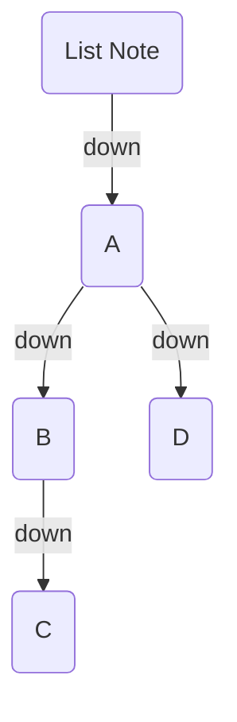
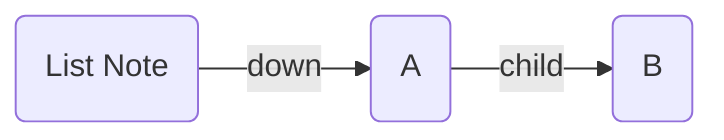
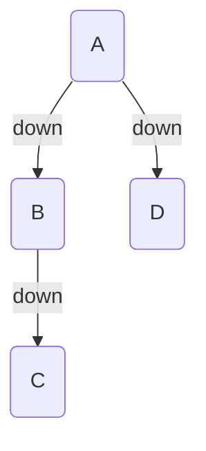
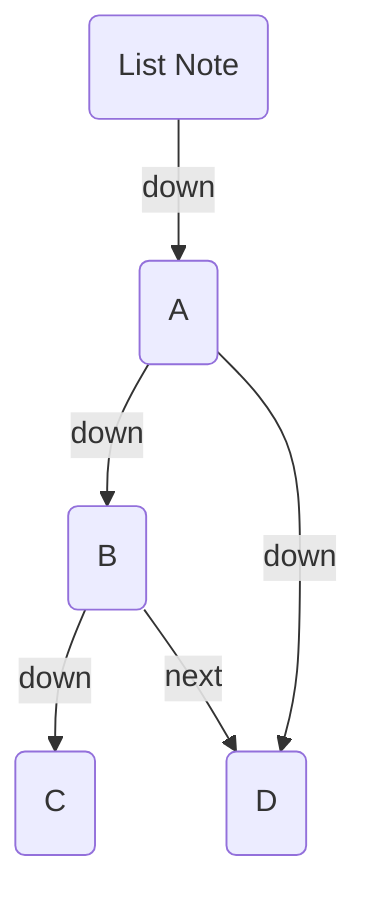

_List Notes_ allow you to leverage your existing bullet list structure. You can turn a note into a List Note by adding the following to your frontmatter:

```yaml
---
BC-list-note-field: "<field>"
---
```

Where `<field>` is one of your [edge fields](/edge-fields/). For example:

```md
---
BC-list-note-field: "down"
---

- [[A]]
  - [[B]]
    - [[C]]
  - [[D]]
```

In this example, `A` goes down to `B` and `D`, and `B`goes down to `C`:



## Field Overrides

By default, each item in the list will use the `BC-list-note-field` value to add edges. But you can override this on a per-item basis by adding the field _before_ the link.

```md
---
BC-list-note-field: "down"
---

- [[A]]
  - child [[B]]
```

Would give:



## `BC-list-note-section`

By default, every list in the note is read. Set `BC-list-note-section` to a heading's text to scope the builder to **just that section** — only list items under that heading become edges.

```yaml
---
BC-list-note-field: "down"
BC-list-note-section: "Index"
---
```

```md
## Index

- [[A]]
- [[B]]

## Notes

- [[C]]
```

Only `A` and `B` become children — the list under `## Notes` is ignored. The section runs from its heading to the next heading of equal-or-higher level (or the end of the file), so nested sub-headings stay inside it. If no heading matches, no edges are added.

## `BC-list-note-exclude`

Keep a link in your list without turning it into a child. `BC-list-note-exclude` is a list of wiki-links to skip — useful for reference / see-also links.

```yaml
---
BC-list-note-field: "down"
BC-list-note-exclude:
  - "[[Glossary]]"
  - "[[See also]]"
---

- [[A]]
- [[Glossary]]
```

`A` becomes a `down` child; `Glossary` stays in the list but gets no edge. Entries must be wiki-links (Breadcrumbs resolves them the same way Obsidian does).

## `BC-list-note-exclude-index`

By default, the list note itself links to the top-level list items. You can exclude this behaviour by adding the `BC-list-note-exclude-index` field to the frontmatter of the list note.

```yaml
---
BC-list-note-field: "down"
BC-list-note-exclude-index: true
---
```



## `BC-list-note-neighbour-field`

Normally, only the parent/child relationships are added. But you can also add edges based on the _neighbours_ of each list item. This is useful for adding sibling/next/prev relationships.

```yaml
---
BC-list-note-neighbour-field: "<field>"
---
```

Where `<field>` is one of your [edge fields](/edge-fields/). For example, point `down` to all child items, and point `next` to each _neighbouring_ item

```md
---
BC-list-note-field: "down"
BC-list-note-neighbour-field: "next"
---

- [[A]]
  - [[B]]
    - [[C]]
  - [[D]]
```



:::note[NOTE]
The layout of the graph kind of obscures it, but `B` and `D` are on the same level here
:::

## Settings

- **Default Neighbour Field**: Choose a default [field](/edge-fields/) to use for the neighbour relationships. This is useful if you have a _lot_ of list notes, and don't want to add the `BC-list-note-neighbour-field` to each one.
