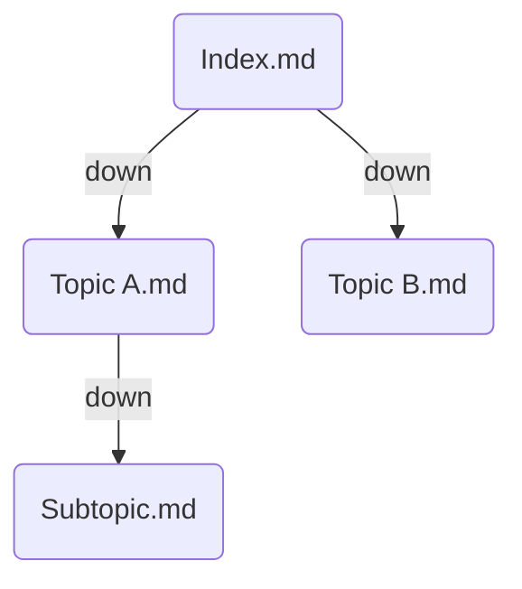

_Traverse Notes_ let you generate a hierarchy from your existing wikilinks without adding frontmatter to every note. Annotate a single root note and Breadcrumbs walks its link graph automatically.

## Frontmatter

Add the following to the root note:

```yaml
---
BC-traverse-note-field: "<field>"
---
```

Where `<field>` is one of your [edge fields](/edge-fields/). Breadcrumbs performs an iterative depth-first search (DFS) starting from that note, following resolved wikilinks and markdown links. It generates one edge per parent→child hop in the DFS tree, all typed with the field you specify.

No special frontmatter is required on the linked notes — only the root note needs the annotation.

### Example

Given a root note `Index.md` that links to `Topic A.md` and `Topic B.md`, and `Topic A.md` links to `Subtopic.md`:

```yaml
# Index.md
---
BC-traverse-note-field: down
---

[[Topic A]] [[Topic B]]
```



Breadcrumbs generates `down` edges: `Index → Topic A`, `Index → Topic B`, `Topic A → Subtopic`.

## Behavior

- **DFS tree only** — each note is visited at most once. If a note is reachable via multiple paths, only the first path (DFS order) produces an edge to it.
- **Cycles ignored** — already-visited notes are skipped, so circular link structures do not cause infinite loops.
- **Resolved links only** — only wikilinks and markdown links that Obsidian has resolved to a real vault file produce edges. Unresolved links (broken links, links to non-existent notes) are silently skipped.

## Settings

- **Default field**: Choose a fallback [field](/edge-fields/) to use when `BC-traverse-note-field` is present but has no value. Useful if you want a vault-wide default so you can write `BC-traverse-note-field:` with no value on each root note.

## When to use Traverse Notes

Traverse notes work well when:

- You have an existing hub note or index that already links to a set of related notes via wikilinks.
- You want a quick hierarchy without manually adding `up`/`down` frontmatter to every note.
- The structure is a tree (or close enough — DFS handles non-trees by picking one path per node).

For more precise control over which notes are related, consider [Typed Links](typed-links/) (explicit per-note frontmatter) or [List Notes](list-notes/) (a note whose list items name its children).
