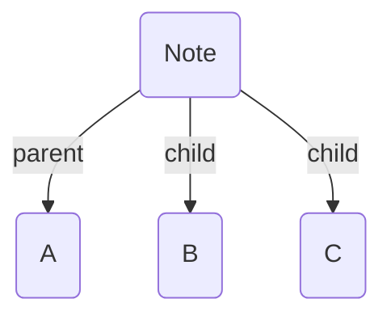

_Typed links_ are the most basic, manual way to add edges to the graph. They can be added in two ways.

## Frontmatter Links

In the YAML frontmatter of your note, you can add key/value pairs indicating a directed link to another note. The keys are your [edge fields](/edge-fields/), while the values are links to different notes in your vault

```yaml
---
parent: "[[A]]"
child: ["[[B]]", "[[C]]"]
---
```

This tells Breadcrumbs that the `parent` of the current note is "A", and that its two `children` are "B" and "C".



## Inline Fields

Breadcrumbs also reads [Dataview](https://github.com/blacksmithgu/obsidian-dataview)-style inline fields in the _content_ of a note. The Dataview plugin is **not** required — Breadcrumbs parses these natively:

```md
parent:: [[A]]
child:: [[B]], [[C]]
```

This creates the same structure as the [frontmatter links](../typed-links/#frontmatter-links) method above.

:::tip[TIP]
Use the [Edge Field Suggester](/suggesters/edge-field-suggester/) to speed up adding inline typed-links
:::

### Markdown Links

Breadcrumbs also detects and adds edges from _markdown links_ in inline fields (no Dataview required). These take the following format:

```md
field:: [note name](path/to/note.md)
```
