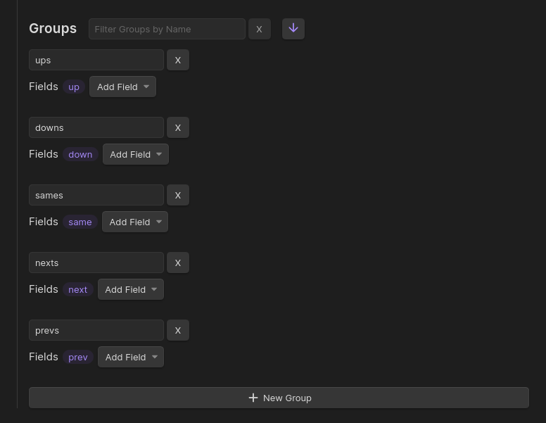

_Field Groups_ are simply a convenience to work with multiple [edge fields](/edge-fields/) at once.

In `Settings > Edge Fields`, you can create new groups and add fields to them. Scroll down past your [Edge Fields](/edge-fields/) to see the list of groups.

:::tip[TIP]
This is a many-to-many relationship, i.e. a group can hold many fields, and a field can belong to many groups.
:::

By default, Breadcrumbs comes with 5 groups, representing the directions: "up", "same", "down", "next", "previous". If you add a new [edge field](/edge-fields/), like `parent`, for example, you could put that field into the `ups` group, because it semantically points "upward" from the child note to the parent.

Similar to the [edge fields](/edge-fields/), you can add/remove groups as you wish. They represent as much or as little as you want them to. They're just a way to select multiple edge fields at once. They're mainly used in the [Views](/views/), to decide which fields are included.
