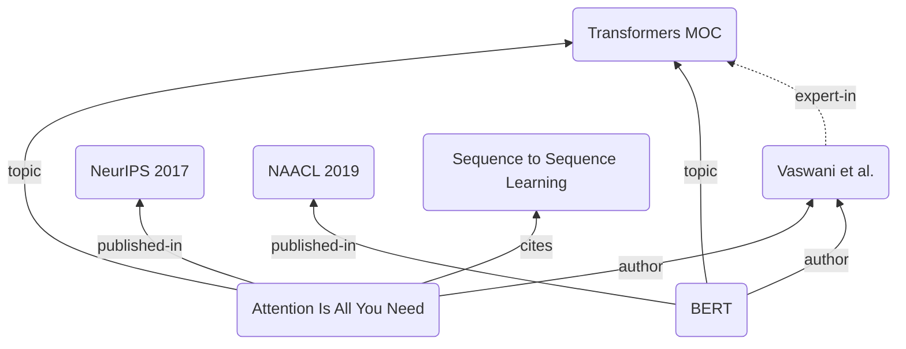
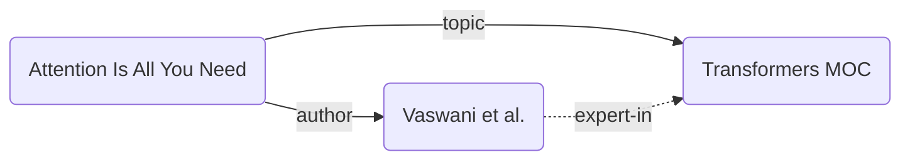
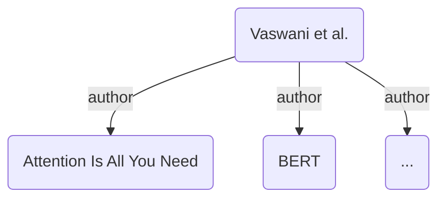

This guide will show you how to build a structured literature network from your academic reading notes. The end result connects papers to their authors, journals, and topic MOCs — and lets you generate per-author bibliographies automatically, infer an author's areas of expertise from the papers they wrote, and bake everything down to plain text before sharing or publishing your vault.



> [!NOTE]
> The `expert-in` edge shown above is _implied_ — Breadcrumbs derives it automatically from the `author` and `topic` chain. You never have to write it by hand.

## Steps

### 1. Set Up Your Fields

We'll use four fields that reflect how academic literature is naturally organised. Add these under your [Edge Fields](/edge-fields/) in `Settings > Edge Fields`:

- `author`: Points up from a paper to its author note
- `published-in`: Points up from a paper to the journal, conference, or book it appeared in
- `cites`: A same-level link from one paper to another paper it references
- `topic`: Points up from a paper to a topic MOC

The end result should look something like this, with `author`, `published-in`, and `topic` all set to an `up` direction and `cites` set to `same`:

![[Academic Reading EdgeFieldSettings.png]]

### 2. Add Typed Links to Your Literature Notes

With the fields in place, annotate each paper note using [Typed Links](/explicit-edge-builders/typed-links/). Frontmatter is the cleanest option for multi-value fields like `author` and `topic`:

**Papers/Attention Is All You Need.md**:

```md
---
author: "[[Vaswani et al.]]"
published-in: "[[NeurIPS 2017]]"
topic:
  - "[[Transformers MOC]]"
  - "[[Attention Mechanisms MOC]]"
---

cites:: [[Sequence to Sequence Learning]]
cites:: [[Neural Machine Translation by Jointly Learning to Align and Translate]]

## Summary

...
```

[Rebuild the graph](/commands/rebuild-graph/) and check the [Matrix View](/views/matrix-view/) on this note. You should see it pointing up to its author, journal, and topics, and sideways to the papers it cites.

### 3. Pull In Existing Dataview Annotations

If you already have a library of literature notes annotated with Dataview inline fields (e.g. `author:: [[Someone]]`), you don't need to re-annotate them — Breadcrumbs can read those fields directly using the [Dataview Notes](/explicit-edge-builders/dataview-notes/) edge builder.

The [Dataview Notes](/explicit-edge-builders/dataview-notes/) edge builder works the other way around: instead of annotating each paper note individually, you add a query to a _hub_ note (such as your author note or a topic MOC), and Breadcrumbs will create edges from that note to every note the query returns.

For example, on an author note you can pull in all papers that list that author in a Dataview `author` field:

**Authors/Vaswani et al..md**:

```yaml
---
BC-dataview-note-field: "author"
BC-dataview-note-query: '"Papers" AND author = [[Vaswani et al.]]'
---
```

Breadcrumbs will ask Dataview for every note inside the `Papers` folder whose `author` field links to `[[Vaswani et al.]]`, then add `author` edges from the author note to each of those papers.

> [!TIP]
> You can test your query in the Obsidian developer console (`Ctrl + Shift + I`) before committing it to the note:
>
> ```ts
> app.plugins.plugins.dataview.api.pages(
>   '"Papers" AND author = [[Vaswani et al.]]',
>   app.workspace.getActiveFile()?.path ?? ""
> );
> ```

### 4. Infer Author Expertise with a Transitive Implied Rule

Right now, each paper links to an author and to a topic. Breadcrumbs can chain those two edges together to automatically infer that the author is an expert in the topics their papers cover — without you writing a single extra link.

Open `Settings > Implied Relations > Transitive` and add the following [Transitive Implied Relations](/implied-edge-builders/transitive-implied-relations/) rule:

- `[author, topic] -> expert-in`



Make sure `expert-in` is also added to your [Edge Fields](/edge-fields/) first, then [rebuild the graph](/commands/rebuild-graph/). Each author note will now have implied `expert-in` edges pointing to every topic covered by their papers.

> [!TIP]
> You can [bulk-add](/implied-edge-builders/transitive-implied-relations/#bulk-add-rules) multiple rules at once. If you also want the reverse — a topic MOC pointing back to its expert authors — add:
>
> ```
> [author, topic] -> expert-in
> [expert-in] <- expert-in
> ```

### 5. Auto-Generated Bibliography with a Codeblock

Now that each author note has edges pointing down to all their papers (either via [Dataview Notes](/explicit-edge-builders/dataview-notes/) or via the implied reverse of the `author` field), you can embed a live bibliography directly in the author note using a [codeblock](/views/codeblocks/):

**Authors/Vaswani et al..md**:

````md
---
BC-dataview-note-field: "author"
BC-dataview-note-query: '"Papers" AND author = [[Vaswani et al.]]'
---

## Papers

```breadcrumbs
type: tree
fields: [author]
depth: [1, 1]
```
````

The `fields: [author]` instruction tells Breadcrumbs to walk the `author` edges from this note. `depth: [1, 1]` limits the output to immediate neighbours — exactly the papers that list this person as an author. Every time you add a new paper note with `author: "[[Vaswani et al.]]"`, it appears in the bibliography automatically.



### 6. Freeze Crumbs Before Sharing or Publishing

Implied edges exist only inside Breadcrumbs' in-memory graph — they are never written to your note files. If you want to share your vault with a colleague who doesn't use Breadcrumbs, or publish it with [[Obsidian Publish]], the `expert-in` edges and any other implied relationships will be invisible to them.

The [Freeze Crumbs to File](/commands/freeze-crumbs-to-file/) command solves this. Open any note that has implied edges (such as an author note with `expert-in` edges), open the command palette, and run **Freeze implied edges to note**. Breadcrumbs will write all current implied edges into the note's frontmatter as plain [Typed Links](/explicit-edge-builders/typed-links/):

**Authors/Vaswani et al..md** (after freezing):

```md
---
BC-dataview-note-field: "author"
BC-dataview-note-query: '"Papers" AND author = [[Vaswani et al.]]'
expert-in:
  - "[[Transformers MOC]]"
  - "[[Attention Mechanisms MOC]]"
  - "[[Natural Language Processing MOC]]"
---
```

Those edges are now explicit and will be visible to anyone browsing the vault, with or without Breadcrumbs installed.

> [!NOTE]
> Freezing is a one-time snapshot. If you add more papers later, the `expert-in` edges in the frontmatter won't update on their own — you'll need to freeze again. For a live vault, it's usually better to leave implied edges as-is and only freeze when you're ready to export or publish.

### 7. Leverage

Your literature network is fully wired up. Here's what you have:

- Every paper points up to its `author`, `published-in` venue, and `topic` MOCs
- Papers point sideways to the papers they `cites`
- Author notes use the [Dataview Notes](/explicit-edge-builders/dataview-notes/) edge builder to stay in sync with your paper library automatically
- A transitive rule derives `expert-in` edges on every author, free of charge
- A `breadcrumbs` codeblock in each author note renders a live, self-updating bibliography
- [Freeze Crumbs to File](/commands/freeze-crumbs-to-file/) lets you bake everything down to portable frontmatter when needed

## Extras/Advanced Usage

### `published-in` Venue Notes

Give each journal or conference its own note and add a [codeblock](/views/codeblocks/) to list everything published there:

**Venues/NeurIPS 2017.md**:

````md
## Papers

```breadcrumbs
type: tree
fields: [published-in]
depth: [1, 1]
```
````

### Citation Chains

Because `cites` is a same-level field, you can follow citation chains across multiple hops. Add a transitive rule `[cites, cites] -> cites` to close the chain, and use a deeper `depth` in your codeblock to see second- and third-generation references from any paper.

### Combining with Date Notes

If your paper notes include a `year` frontmatter field, you can connect them to a [yearly note hierarchy](layered-daily-notes/) using an additional `year` field pointing upward. This lets you browse your reading history chronologically alongside the topical and authorship structure.
