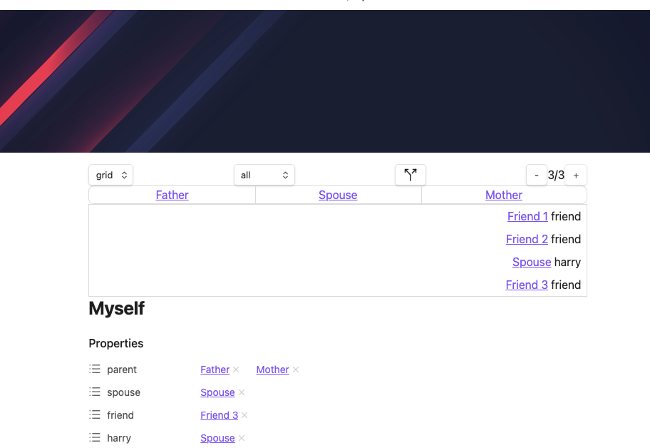
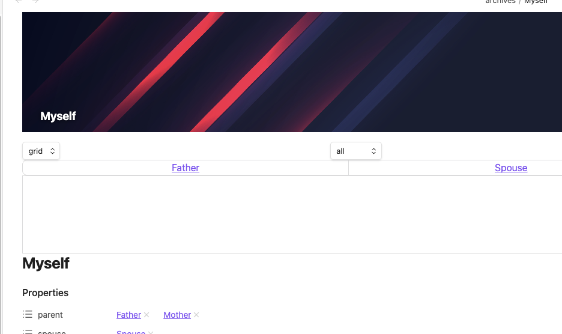
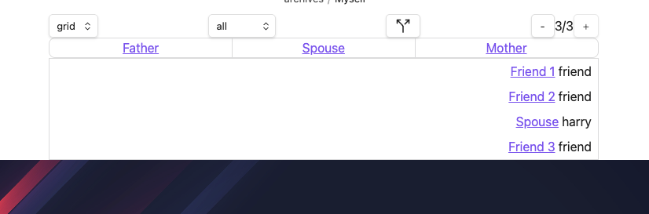

Breadcrumbs Page Views — the [Trail View](/views/trail-view/) and [Previous-Next View](/views/previous-next-view/) — now coexist cleanly with banner plugins (such as Banners Reloaded). Earlier versions inserted Breadcrumbs' DOM at the same anchor point as the banner, causing one or the other to render incorrectly. The next release resolves that conflict and respects both the **Readable Line Width** and **Sticky** options when a banner is present.

See the related fix in [SkepticMystic/breadcrumbs#687](https://github.com/SkepticMystic/breadcrumbs/issues/687).

## Readable Line Width on

With **Readable Line Width** enabled, the Page Views are constrained to the same width as the note body and sit below the banner — aligned with the readable text column.

## Readable Line Width off

With **Readable Line Width** disabled, the Page Views span the full width of the editor pane while the banner continues to render full-bleed above them.

## Sticky Page Views

With **Sticky** enabled, the Page Views remain pinned at the top of the note as you scroll. The banner scrolls away normally and the breadcrumbs stay visible.

## Related

- [Page Views](/views/page-views/) — settings reference for Readable Line Width and Sticky
- [Trail View](/views/trail-view/)
- [Previous-Next View](/views/previous-next-view/)
