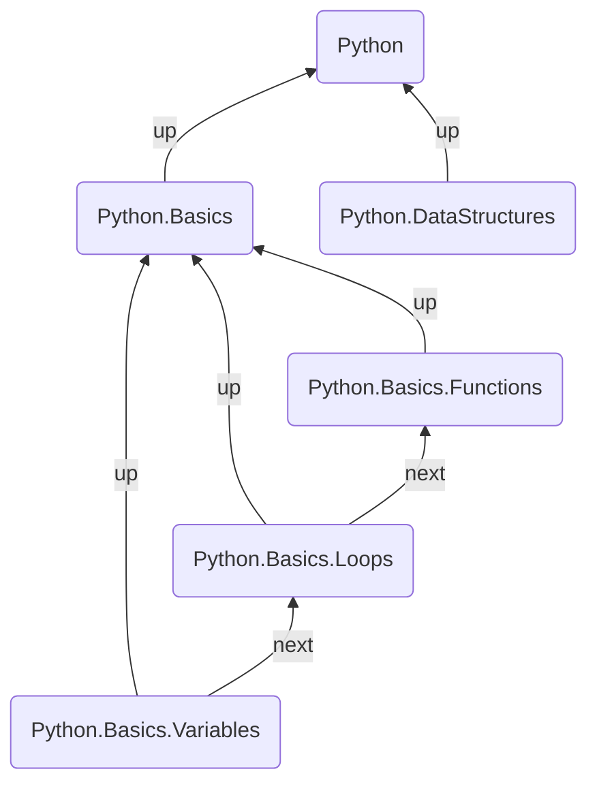
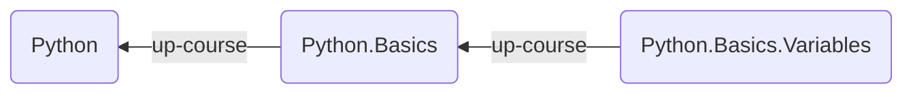
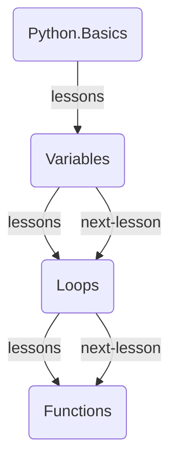
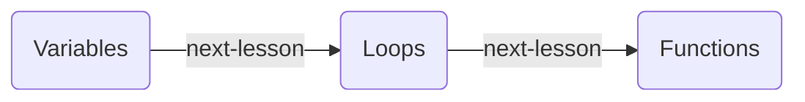

This guide shows you how to build a structured, navigable course inside Obsidian using Breadcrumbs. The end result is a self-contained curriculum where the hierarchy is derived automatically from note names, lessons are linked in sequence with next/previous navigation, and learners can browse the full course outline from a single note — no manual frontmatter required.



There are a few ways to build this structure. This guide uses [Dendron Notes](/explicit-edge-builders/dendron-notes/) (or [Regex Notes](/explicit-edge-builders/regex-notes/) as an alternative) to derive the Course → Module → Lesson hierarchy automatically from your note names. [List Notes](/explicit-edge-builders/list-notes/) in each module then add an ordered `next` sequence between lessons. A [codeblock tree](/views/codeblocks/) in the top-level Course note renders the full curriculum, and the [Previous-Next View](/views/previous-next-view/) gives learners a persistent navigation bar.

> [!NOTE]
> The `next` edges between lessons aren't shown in full in the Mermaid graph above, as it would clutter the layout. The core idea is: `up/down` fields for the Course → Module → Lesson hierarchy, and `next/prev` fields for moving through lessons in order.

## Steps

### 1. Set Up Your Fields

We'll use specific fields rather than the generic defaults. Add the following in `Settings > Edge Fields`:

- `up-course`: Points up from a lesson or module to its parent
- `lessons`: Points down from a module to its lessons
- `next-lesson`: Points "right" from one lesson to the next
- `prev-lesson`: Points "left" from one lesson to the previous

The end result should look like this in your Edge Fields settings:

![[Course Builder EdgeFieldSettings.png]]

### 2. Name Your Notes

The hierarchy is encoded directly in the note name. Use a dot (`.`) as a delimiter — exactly like the [Dendron](https://www.dendron.so/) system:

```
Python
Python.Basics
Python.Basics.Variables
Python.Basics.Loops
Python.Basics.Functions
Python.DataStructures
Python.DataStructures.Lists
Python.DataStructures.Dicts
```

No frontmatter is needed at all for the hierarchy. Breadcrumbs reads the note names and infers the edges.

> [!TIP]
> Keep each segment short and use consistent casing. Breadcrumbs can display a trimmed version of the name (e.g. `Variables` instead of `Python.Basics.Variables`) — enable **Display Trimmed** in the Dendron settings.

### 3. Enable Dendron Notes

Go to `Settings > Edge Sources > Dendron Notes` and configure as follows:

- **Enable**: on
- **Field**: `up-course`
- **Delimiter**: `.`
- **Display Trimmed**: on (recommended)

[Rebuild the graph](/commands/rebuild-graph/) and check the [Matrix View](/views/matrix-view/) from any lesson note — you should see it pointing `up-course` to its module, and the module pointing `up-course` to the course root.



#### Alternative: Regex Notes

If you prefer a different naming convention — for example, `Python - Basics - Variables` with a ` - ` separator — you can use [Regex Notes](/explicit-edge-builders/regex-notes/) instead of Dendron Notes. Create an index note (e.g. `Python`) and add:

```yaml
---
BC-regex-note-field: "lessons"
BC-regex-note-regex: "^Courses/Python"
BC-regex-note-flags: "i"
---
```

This will match all notes under the `Courses/Python` folder and add `lessons` edges pointing down to them from the index note. You can create one Regex Note per module to narrow the scope further.

### 4. Add a List Note for Each Module

The Dendron edge builder gives you the hierarchy, but not the _order_ of lessons within a module. For that, create a [List Note](/explicit-edge-builders/list-notes/) inside each module.

**Python.Basics.md** (add to the body of the note):

```md
---
BC-list-note-field: "lessons"
BC-list-note-neighbour-field: "next-lesson"
---

- [[Python.Basics.Variables]]
- [[Python.Basics.Loops]]
- [[Python.Basics.Functions]]
```

The `BC-list-note-field` adds `lessons` edges from the module down to each lesson. The `BC-list-note-neighbour-field` adds `next-lesson` edges between each consecutive lesson in the list — so `Variables → Loops → Functions` automatically.



> [!NOTE]
> The module note now serves double duty: it's part of the Dendron hierarchy _and_ it's the List Note that defines lesson order. The two edge builders work independently and combine in the graph.

Repeat this for every module in the course.

### 5. Implied Relationships

We added `next-lesson` explicitly (via the List Note), but not `prev-lesson`. Similarly, the `lessons` field goes downward from module to lesson, but we haven't explicitly added the reverse `up-course` direction from lesson to module — Dendron Notes already handles that, but `prev-lesson` still needs to be inferred.

Open `Settings > Implied Relations > Transitive` and add:

- `[next-lesson] <- prev-lesson`

![[transitive (next-lesson) <- prev-lesson.png]]

> [!TIP]
> You can [bulk-add](/implied-edge-builders/transitive-implied-relations/#bulk-add-rules) the rule:
>
> ```
> [next-lesson] <- prev-lesson
> ```

After [rebuilding the graph](/commands/rebuild-graph/), every lesson will automatically have a `prev-lesson` edge pointing back, without you having to maintain it manually.

### 6. Add a Curriculum Codeblock to the Course Note

Open the top-level course note (e.g. `Python`) and add a `breadcrumbs` codeblock. This renders the full curriculum as a collapsible tree:

**Python.md**:

````md
## Curriculum

```breadcrumbs
type: tree
fields: [lessons]
merge-fields: true
collapse: true
sort: neighbour-field:next-lesson
```
````

- `fields: [lessons]` traverses only the `lessons` edges, so the tree shows modules and their lessons
- `merge-fields: true` follows `lessons` edges regardless of depth, giving the full Course → Module → Lesson structure
- `collapse: true` starts the list folded — learners can expand only the module they're working on
- `sort: neighbour-field:next-lesson` orders siblings by their position in the `next-lesson` chain, matching the sequence from your List Notes

![[Course Builder Codeblock Tree.png]]

### 7. Enable the Previous-Next View

The [Previous-Next View](/views/previous-next-view/) adds a persistent navigation bar at the top of every note, showing the previous and next lesson.

Go to `Settings > Views > Page > Previous/Next`:

- **Enable**: on
- **Left Field Group**: set to a group that contains `prev-lesson`
- **Right Field Group**: set to a group that contains `next-lesson`

> [!TIP]
> If you don't have field groups set up yet, see [Field Groups](/field-groups/). Create a `course-nexts` group containing `next-lesson` and a `course-prevs` group containing `prev-lesson`, then assign these to the right and left sides of the view respectively.

Once enabled, every lesson note will display something like this at the top:

```
← Python.Basics.Variables        Python.Basics.Functions →
```

Learners never have to leave the note to move forward or backward through the curriculum.

### 8. Assign a Hotkey for Keyboard Navigation

For a fully keyboard-driven experience, assign a hotkey to the **Jump to First Neighbour** command.

1. Open Obsidian settings and navigate to `Hotkeys`
2. Search for `Breadcrumbs: Jump to First Neighbour in group:course-nexts`
3. Assign a key combination, for example `Alt+Right`
4. Optionally, assign `Alt+Left` to `Jump to First Neighbour in group:course-prevs`



Now a learner can press `Alt+Right` at the end of any lesson to jump straight to the next one — no mouse required.

> [!TIP]
> Assign hotkeys to _both_ directions so learners can move fluidly back and forth. The [Layered Daily Notes](../layered-daily-notes/) guide uses the same pattern for navigating between daily notes.

## Extras/Advanced Usage

### Multi-Course Vault

If your vault contains several courses, prefix each course with a namespace: `Python`, `JavaScript`, `DataScience`. Each Dendron hierarchy is self-contained, so Breadcrumbs will build separate graphs for each course automatically.

You can then create a master index note with one codeblock per course, each using `start-note` to point at the correct course root:

````md
```breadcrumbs
type: tree
fields: [lessons]
merge-fields: true
collapse: true
start-note: Python.md
```
````

### Tracking Progress with Tags

Add a `#done` tag to completed lesson notes. Then filter the curriculum codeblock using `dataview-from` to see only remaining lessons:

````md
```breadcrumbs
type: tree
fields: [lessons]
merge-fields: true
collapse: true
dataview-from: '-#done'
```
````

### Ordering Across Modules

To create a single `next-lesson` chain that spans _across_ modules (so the last lesson of one module links to the first lesson of the next), simply include cross-module links in a top-level List Note on the Course note itself:

```md
---
BC-list-note-neighbour-field: "next-lesson"
BC-list-note-exclude-index: true
---

- [[Python.Basics.Variables]]
- [[Python.Basics.Loops]]
- [[Python.Basics.Functions]]
- [[Python.DataStructures.Lists]]
- [[Python.DataStructures.Dicts]]
```

Setting `BC-list-note-exclude-index: true` prevents the course note itself from being added as a parent of every lesson. The result is one continuous `next-lesson` chain across the whole course.
