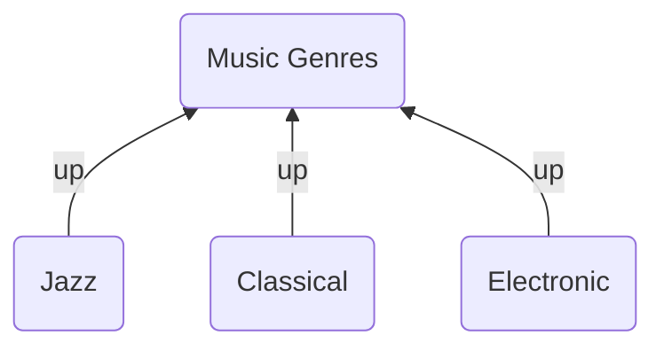
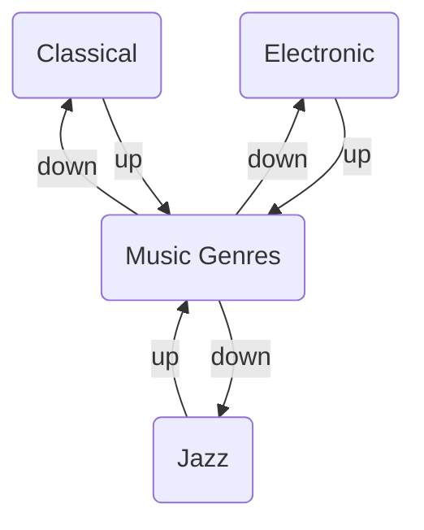

Breadcrumbs is built around a simple idea: links between notes can have a _type_. That type is called an [edge field](/edge-fields/), and it's what turns a flat web of connections into a navigable hierarchy. This guide walks you through creating your first hierarchy from scratch — from understanding the default fields, to adding your first typed link, to seeing the result in the [Matrix View](/views/matrix-view/) and [Trail View](/views/trail-view/).



## Steps

### 1. Understand Edge Fields

[Edge Fields](/edge-fields/) are the names you give to the relationships between notes. Every link you add through Breadcrumbs uses one of these field names as its "type".

Out of the box, Breadcrumbs ships with five default fields:

| Field  | Direction | Typical meaning                        |
| ------ | --------- | -------------------------------------- |
| `up`   | Up        | This note belongs to a parent note     |
| `down` | Down      | This note contains child notes         |
| `same` | Same      | This note is a sibling of another note |
| `next` | Next      | This note comes after another note     |
| `prev` | Prev      | This note comes before another note    |

These defaults are intentionally generic, and they're a great place to start. `up` and `down` alone are enough to build a complete topic hierarchy.

> [!TIP]
> **When to keep the defaults**: If your vault is primarily one type of content — notes, ideas, topics — the defaults work well. `up:: [[My MOC]]` is perfectly clear.
>
> **When to rename them**: Once you have _multiple_ kinds of hierarchy in the same vault, more specific names prevent confusion. The [Layered Daily Notes](layered-daily-notes/) guide uses `month` and `year` instead of plain `up`, so there's no ambiguity about which "up" is meant.

You can view and edit your fields under `Settings > Edge Fields`.

### 2. Create the Example Notes

For this guide, we'll build a small music-genre hierarchy. Create four notes:

- `Music Genres` — the top-level MOC (Map of Content)
- `Jazz`
- `Classical`
- `Electronic`

You don't need any content in them yet.

### 3. Add Your First Typed Link

Open the `Jazz` note and add an `up` field pointing to `Music Genres`. You can use either the YAML frontmatter or a Dataview inline field — both work identically.

**Frontmatter (YAML)**

```md
---
up: "[[Music Genres]]"
---
```

**Dataview inline field** (requires the [Dataview](https://github.com/blacksmithgu/obsidian-dataview) plugin)

```md
up:: [[Music Genres]]
```

Now do the same for `Classical` and `Electronic`. Each of the three child notes should have `up: "[[Music Genres]]"` in its frontmatter (or as a Dataview field).

> [!INFO]
> In the language of Breadcrumbs, you've just used the [typed-link edge builder](/explicit-edge-builders/typed-links/) to add three [explicit edges](/explicit-edge-builders/), each using the `up` [edge field](/edge-fields/).

### 4. Rebuild the Graph

Adding typed links to your notes doesn't automatically update what Breadcrumbs knows. You need to tell it to re-read your vault.

Run the **Breadcrumbs: [Rebuild Graph](/commands/rebuild-graph/)** command (open the command palette with `Cmd/Ctrl+P` and search for "Rebuild Graph").

> [!NOTE]
> This is the most common first-time stumbling block. If you don't see your new edges in any view, [rebuilding the graph](/commands/rebuild-graph/) is almost always the fix.

### 5. Open the Matrix View

With one of the child notes open (e.g. `Jazz`), run the **Breadcrumbs: Open [Matrix View](/views/matrix-view/)** command.

You'll see the Matrix View appear in the sidebar. Under the `up` section, it should show `[[Music Genres]]`. That's your edge — the link from `Jazz` up to its parent MOC.

Now switch to the `Music Genres` note. The Matrix View will flip to the perspective of that note, and under `down` you'll see all three child notes listed: `Jazz`, `Classical`, and `Electronic`.

> [!TIP]
> The `down` edges weren't added manually — Breadcrumbs infers them automatically as the opposite of the `up` edges you added. This is the [implied edges](/implied-edge-builders/implied-edge-builders/) system at work.

### 6. Open the Trail View

The [Trail View](/views/trail-view/) appears at the top of each note and shows all paths going _up_ from the current note. Open any of the three child notes and you should see a trail leading back to `Music Genres`.

> [!INFO]
> The Trail View reads right-to-left. The right-most entry is the immediate neighbour of the current note; entries further left are further away in the hierarchy. It works like a file path in a file explorer.

Enable or disable the Trail View under `Settings > Views > Page > Trail > Enable`.

## The Full Picture

Here's the complete structure you've just built:



The `up` edges were added explicitly via [Typed Links](/explicit-edge-builders/typed-links/). The `down` edges back from `Music Genres` to each child were added automatically by Breadcrumbs as implied edges.

## Common First-Time Mistakes

**Forgetting to rebuild the graph**
Changes to your notes are not picked up until you run [Rebuild Graph](/commands/rebuild-graph/). If a new edge isn't showing up, this is the first thing to check. You can also configure Breadcrumbs to rebuild automatically on save under `Settings > Commands > Rebuild Graph > Triggers`.

**Linking to a note that doesn't exist**
If you type `up: "[[Musci Genres]]"` (a typo), Breadcrumbs will create an edge to a non-existent note. The Matrix View will show the link, but clicking it will prompt you to create the note. Check your spelling, then rebuild.

**Using the wrong field name**
If you write `parent: "[[Music Genres]]"` but `parent` isn't in your [Edge Fields](/edge-fields/) settings, Breadcrumbs will silently ignore the link. Always make sure the field name in your note matches exactly what's listed under `Settings > Edge Fields`.

**Expecting both directions to be explicit**
You only need to add the `up` link in the child note. You do _not_ need to also add a `down` link in the parent — Breadcrumbs infers it. Adding both manually is redundant and can cause duplicates in the Matrix View.

## Next Steps

Once you're comfortable with a basic hierarchy, consider:

- Renaming the generic fields to something more meaningful for your vault, as shown in the [Layered Daily Notes](layered-daily-notes/) guide
- Modelling relationships between people using the [Personal Relationship Management](personal-relationship-management/) guide
- Using a [codeblock](/views/codeblocks/) in your `Music Genres` MOC note to auto-generate a list of all child notes
