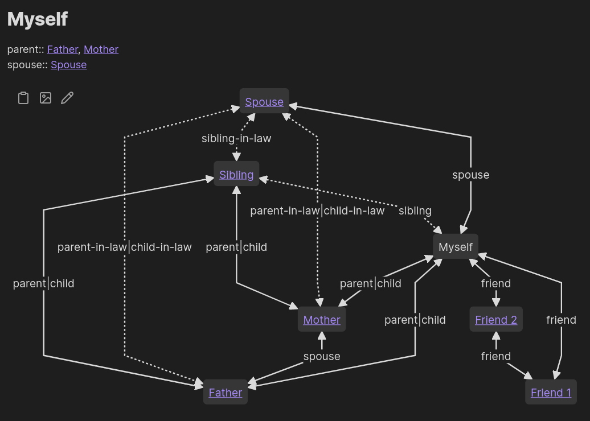
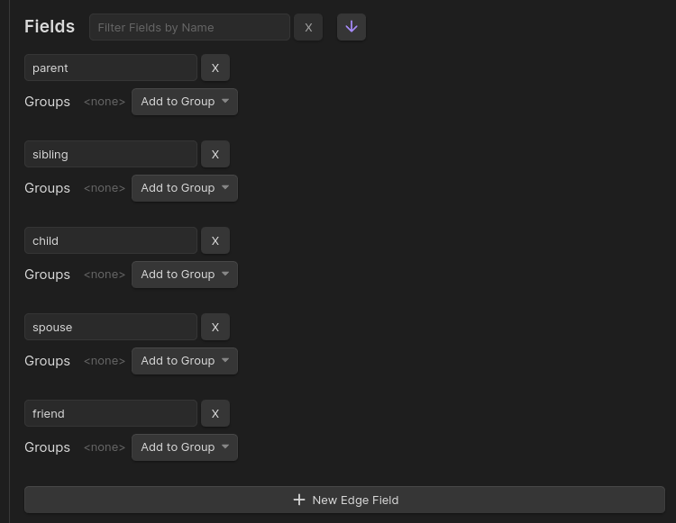

Similar to [Monica](https://github.com/monicahq/monica), Breadcrumbs can be used to manage personal relationships. Vanilla Obsidian can easily handle alot of the functionality of a personal CRM, but Breadcrumbs is particularly helpful when it comes to noting relationships between people, and inferring more complex relations from those.

Using just a handful of simple, manual relations, we can automatically build complex networks of personal connections. For example, in a basic setup starting with the note `[[Myself]]`:



## Steps

### 1. Edge Fields

We'll start off with some basic, immediate relationships. Add these under your [Edge Fields](/edge-fields/) in `Settings > Edge Fields`:

- `parent`
- `sibling`
- `child`
- `spouse`
- `friend`



### 2. Add Some Typed-links

Next, add some notes for different people, and link them up using these new fields. For example, in the note about yourself, you can add the following (using the [typed-link edge builder](/explicit-edge-builders/typed-links/)):

**Me.md**

```md
---
parent: "[[Father]]"
---

%% Dataview inline fields work, too %%

parent:: [[Mother]]
```

[Rebuild the graph](/commands/rebuild-graph/), check the [Matrix View](/views/matrix-view/), and confirm that the note points to your parents.

### 3. Implied Relationships

Using the [Implied Edge Builders](/implied-edge-builders/), we can craft custom relationships for Breadcrumbs to add automatically, based on the simpler ones added previously. For example, we could add the following:

- `[parent] <- child`: You are your parent's child

-<--child.png)

- `[parent, child] -> sibling`: Your parent's other children are your siblings

-->-sibling.png)

- `[spouse, sibling] -> sibling-in-law`: Your spouse's sibling is your sibling-in-law

-->-sibling-in-law.png)

> [!NOTE]
> You can use any combination of fields in the implied rules. But the closing field also has to be in your [Edge Fields](/edge-fields/), so remember to add them there first.

> [!TIP]
> You can also [bulk-add](/implied-edge-builders/transitive-implied-relations/#bulk-add-rules) the rules:
>
> ```
> [parent] <- child
> [parent, child] -> sibling
> [spouse, sibling] -> sibling-in-law
> ```

After adding some implied relations, [rebuild the graph](/commands/rebuild-graph/), and check the [Matrix View](/views/matrix-view/) again. You should see some extra relationships filled in, without you having to explicitly define them!

### 4. Visualising

After you've expanded your people-graph, you can visualise it using a [mermaid codeblock](/views/codeblocks/). The following shows _all_ relationships from the perspective of the current note (⚠️ resulting in a potentially huge graph):

```
type: mermaid
merge-fields: true
show-attributes: [field]
```

## Extras/Advanced Usage

### More Fields

You can model many other types of relationships, for example:

- Work relationships: `manager`, `manages`, `colleague`
- School relationships: `teacher`, `student`, `class-mate`
