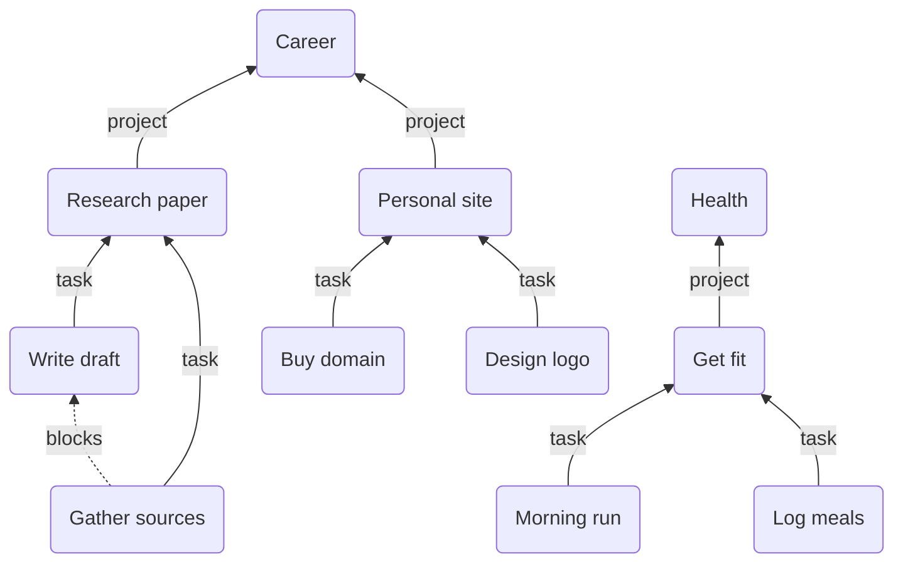
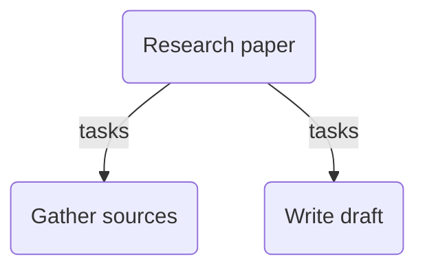
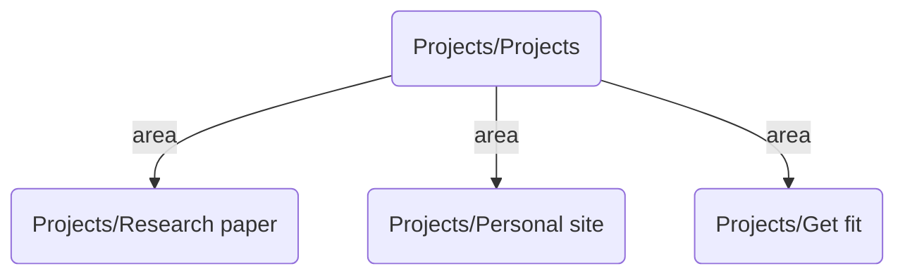
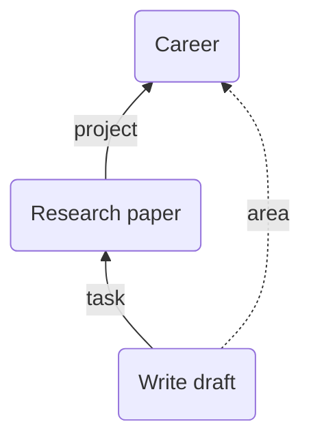

Breadcrumbs can model a full project-management hierarchy — from broad life areas down to individual tasks, with dependency edges running across the same level. The end result lets you trace any task back to the area it serves, see every project and task in a single Mermaid diagram, and run weekly reviews without leaving Obsidian.



## Steps

### 1. Set Up Your Fields

Define four fields under `Settings > Edge Fields` ([Edge Fields](/edge-fields/)):

- `project`: Points up from a project note to the life-area note it belongs to
- `area`: Points down from a life-area note to its projects _(or omit this and derive it with an implied rule later)_
- `task`: Points up from a task note to the project note it belongs to
- `blocks`: Points forward from one task to a task it must precede

> [!NOTE]
> `blocks` and `blocked-by` live at the same level in the hierarchy — they express dependencies between sibling tasks, not parent/child relationships. You only need to add `blocks`; `blocked-by` can be derived automatically in [step 4](#4.-implied-relationships).

The finished field list should look something like this:

| Field | Direction | Purpose |
|---|---|---|
| `project` | up | task or project → area |
| `area` | down | area → projects |
| `task` | up | task → project |
| `tasks` | down | project → tasks |
| `blocks` | same | task → task it blocks |
| `blocked-by` | same | task → task blocking it |

### 2. List Notes — Defining a Project's Tasks

Rather than opening every task note and adding a `task: [[My Project]]` frontmatter field by hand, use a [List Note](/explicit-edge-builders/list-notes/) on the project itself. Create your project note and add a bullet list of its tasks:

**Projects/Research paper.md**

```md
---
project: "[[Career]]"
BC-list-note-field: "tasks"
---

## Tasks

- [[Gather sources]]
- [[Write draft]]
```

Breadcrumbs reads the bullet list and automatically adds a `tasks` edge from `Research paper` down to each linked task note — no frontmatter needed inside `[[Gather sources]]` or `[[Write draft]]` themselves.



> [!TIP]
> You can nest bullets to model sub-tasks. A nested item will be linked from its parent bullet, not directly from the project note. Use [field overrides](/explicit-edge-builders/list-notes/#field-overrides) on individual items if a particular task needs a different field.

For cross-task dependencies, simply add the `blocks` field inside the task note that comes first:

**Gather sources.md**

```md
---
blocks: "[[Write draft]]"
---
```

### 3. Folder Notes — Linking Every Project to an Index

Keep all your project notes inside a `Projects/` folder. Create an index note in that same folder and mark it as a [Folder Note](/explicit-edge-builders/folder-notes/):

**Projects/Projects.md**

```md
---
BC-folder-note-field: "area"
---

# Projects

An index of all active projects.
```

Breadcrumbs will automatically add an `area` edge from `Projects` down to every other note in the `Projects/` folder — including notes you add later. You never need to manually link a new project to the index.



> [!NOTE]
> Each project note still carries its own `project: [[Career]]` (or whichever life-area note applies) in its frontmatter. The Folder Note gives you a flat index of all projects in one place, while the `project` field in each note provides the meaningful hierarchy.

### 4. Implied Relationships

Several relationships can be _derived_ rather than typed manually. Open `Settings > Implied Relations > Transitive` and add the following [Transitive Implied Relations](/implied-edge-builders/transitive-implied-relations/):

- `[task] <- tasks` — the reverse of the `tasks` field: any task note now also knows which project it belongs to

- `[blocks] <- blocked-by` — the reverse of `blocks`: `Write draft` now knows it is `blocked-by` `Gather sources`

- `[project, task] -> area` — traverse two hops (project → area, then area → tasks) to give every task note a direct `area` edge back to its life area

> [!TIP]
> You can [bulk-add](/implied-edge-builders/transitive-implied-relations/#bulk-add-rules) all three rules at once:
>
> ```
> [task] <- tasks
> [blocks] <- blocked-by
> [project, task] -> area
> ```

The third rule is the most powerful for weekly reviews: instead of manually navigating up two levels, every task note will show its life area directly in the [Matrix View](/views/matrix-view/), making it easy to filter or group by area across your whole vault.



After adding the rules, [rebuild the graph](/commands/rebuild-graph/) and confirm the implied edges appear.

### 5. Visualising the Full Tree

In your life-area note, add a [Breadcrumbs codeblock](/views/codeblocks/) to render the entire project/task tree beneath it:

**Career.md**

```md
---
# no Breadcrumbs frontmatter needed here
---

## Projects & Tasks

​```breadcrumbs
type: mermaid
fields: [area, tasks]
merge-fields: true
show-attributes: [field]
​```
```

This produces a Mermaid diagram scoped to the current note, traversing `area` edges down to projects and `tasks` edges further down to individual tasks. Because the diagram is generated dynamically, it stays up to date as you add projects and tasks.

> [!TIP]
> Swap `type: mermaid` for `type: tree` if you prefer an indented outline instead of a graph. The `fields` option controls which edge fields are followed, so you can limit the view to just `area` if you only want to see projects without drilling into tasks.

### 6. Leverage

You're all set up. Here's what you get without any further effort:

- **Any project note** shows its tasks in the [Matrix View](/views/matrix-view/) (`tasks` field pointing down) and its life area (`project` field pointing up).
- **Any task note** shows its parent project (`task` field pointing up) and its life area directly (implied `area` edge), as well as what it `blocks` or is `blocked-by`.
- **The area note** renders a live Mermaid diagram of the full project/task tree.
- **The Projects index** (via Folder Note) always lists every project note, even newly created ones.

## Extras/Advanced Usage

### Weekly Review with Matrix View

Open any life-area note and use the [Matrix View](/views/matrix-view/) to see all projects and tasks that roll up to that area — including tasks two levels down, thanks to the implied `[project, task] -> area` rule. Filter by `blocked-by` to surface anything that is currently stuck.

### Tracking Task Status with Note Attributes

Add a `status` [note attribute](/note-attributes/) (e.g. `todo`, `in-progress`, `done`) to each task note. You can then use a [codeblock](/views/codeblocks/) with a `where` filter to show only active tasks in your area note's dashboard:

````md
```breadcrumbs
type: tree
fields: [area, tasks]
where: note.attr("status") != "done"
```
````

### `blocks` / `blocked-by` Navigation

Assign hotkeys to the [Jump to First Neighbour](/commands/jump-to-first-neighbour/) command and bind them to the `blocks` and `blocked-by` fields. This lets you jump quickly along a dependency chain from any task note without opening the graph.
