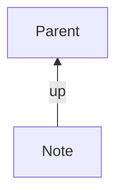

As your vault grows, so does your Breadcrumbs graph — and it can become difficult to know exactly what Breadcrumbs is inferring versus what you actually wrote. This guide walks through a set of practical maintenance habits: reading the graph's statistics to understand its shape, auditing which edges are explicit versus implied, making implied edges permanent when you need to, and using CSS to make the distinction visible at a glance.

## Steps

### 1. Read the Graph with Graph Stats

The first step in any audit is getting an overview. Run the [Graph Stats](/commands/graph-stats/) command (`Ctrl/Cmd + P` → "Breadcrumbs: Show graph stats") to generate a summary of every node and edge attribute in your current graph.

The output is copied to your clipboard and printed to the console at the `FEAT` [log level](/debugging/#log-levels). Open the developer console (`Ctrl + Shift + I`) to read it there, or paste it into a scratch note. The structure looks like this:

```json
{
  "nodes": {
    "resolved": { "true": 312, "false": 4 }
  },
  "edges": {
    "field": { "up": 120, "down": 108, "same": 14, "next": 88 },
    "explicit": { "true": 210, "false": 220 },
    "source": { "typed_link": 180, "date_note": 30 },
    "implied_kind": { "opposite_direction": 180, "same_field_sibling_of": 40 }
  }
}
```

A few things to look for:

- **`edges.explicit`**: If implied edges outnumber explicit ones by a large margin, your graph depends heavily on inference. That's not necessarily wrong, but it's worth knowing.
- **`edges.field`**: Which fields are carrying the most weight? A field with unexpectedly high counts might indicate a misconfigured implied rule.
- **`edges.source`**: Tells you which [edge builders](/explicit-edge-builders/) are active. If `date_note` shows a large count you didn't expect, check your [Date Notes](/explicit-edge-builders/date-notes/) settings.
- **`nodes.resolved` false count**: Unresolved nodes are notes referenced in edges that don't exist as `.md` files. A non-zero count is worth investigating.

> [!TIP]
> Run Graph Stats after any significant change to your [implied relations](/implied-edge-builders/) settings. Comparing counts before and after is the fastest way to confirm a rule is doing what you intended.

### 2. Audit Explicit vs. Implied Edges with `show-attributes`

Graph Stats gives you counts, but doesn't tell you _which_ individual notes are using implied edges. For a file-level audit, use a [codeblock](/views/codeblocks/) with `show-attributes: [source]` to see where each edge comes from.

Add this codeblock to any note — for example, a dedicated `Vault Audit` note:

````md
```breadcrumbs
type: tree
fields: [up, down, same]
merge-fields: true
show-attributes: [source]
```
````

Each item in the resulting tree will show its source attribute next to it. Edges you wrote yourself will show a source like `typed_link` or `date_note`. Implied edges will show `implied` instead.

> [!NOTE]
> The `source` attribute is only populated for explicit edges. For implied edges, Breadcrumbs shows the `implied_kind` instead — for example, `opposite_direction` or `same_field_sibling_of`. This distinction is useful when tracking down unexpected connections.

You can also combine `show-attributes` with `show-attributes: [field, source]` to see both the edge field _and_ its origin at once:

````md
```breadcrumbs
type: tree
merge-fields: true
show-attributes: [field, source]
depth: [0, 1]
```
````

This is particularly useful on hub notes — like a monthly note or a project index — where many edges converge.

### 3. Scope Your Audit with `dataview-from`

For large vaults, auditing the entire graph from a single note can produce an overwhelming list. The `dataview-from` option lets you filter which notes are included in the traversal, using a [Dataview](http://blacksmithgu.github.io/obsidian-dataview/) query string.

For example, to audit only notes in a specific folder:

````md
```breadcrumbs
type: tree
merge-fields: true
show-attributes: [source]
dataview-from: '"Projects"'
```
````

Or to audit notes carrying a particular tag:

````md
```breadcrumbs
type: tree
merge-fields: true
show-attributes: [source]
dataview-from: '#area and !"Archive"'
```
````

> [!NOTE]
> The `dataview-from` filter requires the [Dataview plugin](http://blacksmithgu.github.io/obsidian-dataview/) to be installed and enabled. The query string follows Dataview's `FROM` syntax.

This makes it practical to audit one section of the vault at a time — for example, checking that all your `Projects` notes have explicit `up` edges before archiving them.

### 4. Freeze Implied Edges to a File

Once you've identified notes that rely on implied edges, you may want to make those edges explicit. The [Freeze implied edges to note](/commands/freeze-crumbs-to-file/) command does exactly this: it writes all implied edges leaving the current note into the file as [typed-links](/explicit-edge-builders/typed-links/).

There are a few situations where this is especially useful:

- **Before publishing with Obsidian Publish**: Publish exports the raw markdown of your notes. Breadcrumbs' implied edges are computed at runtime inside Obsidian and won't be present in the exported files. Freezing them beforehand ensures the links are physically in the note.
- **Before exporting or migrating your vault**: For the same reason — any system reading your markdown directly won't see inferred edges.
- **Reducing plugin dependency**: If you want a set of notes to remain navigable even without Breadcrumbs installed, freeze the edges first so the links are in plain frontmatter.

To use the command:

1. Open the note whose implied edges you want to freeze.
2. Run `Ctrl/Cmd + P` → "Breadcrumbs: Freeze implied edges to note".
3. Choose whether to write the edges as [frontmatter links](/explicit-edge-builders/typed-links/#frontmatter-links) or [Dataview inline fields](/explicit-edge-builders/typed-links/#dataview-links).

Before freezing, the note might look like this (with a dashed implied edge):


After running the command, the `up` link is written directly into the note's frontmatter:

```md
---
up: "[[Parent]]"
---
```



> [!WARNING]
> Freezing edges is a one-way operation for the current note. The edge becomes explicit, so if your implied rules change later, the now-explicit edge won't automatically update. Review the results after freezing to make sure they match your intent.

> [!TIP]
> If you want to freeze edges across many notes at once, consider using the [codeblock audit](/views/codeblocks/) approach from step 2 first to identify which notes have implied edges, then work through them note by note.

### 5. Style Explicit and Implied Edges in Views

Once you understand the distinction between explicit and implied edges, it's helpful to make it visible. Breadcrumbs adds CSS classes to its views that reflect edge attributes, so you can use a CSS snippet to style implied items differently.

> [!NOTE]
> The [Styling](/styling/) page is the authoritative reference for all Breadcrumbs CSS classes. What follows are practical examples for this specific use-case.

Create a new CSS snippet in your vault (`.obsidian/snippets/breadcrumbs-audit.css`) and enable it under `Settings > Appearance > CSS snippets`. A simple starting point:

```css
/* Dim implied edges in the Tree View */
.BC-tree .BC-node[data-explicit="false"] {
  opacity: 0.6;
  font-style: italic;
}

/* Highlight explicit typed-link edges with a subtle marker */
.BC-tree .BC-node[data-source="typed_link"]::before {
  content: "✎ ";
  font-size: 0.75em;
  opacity: 0.5;
}
```

You can take a similar approach in [codeblock trees](/views/codeblocks/):

```css
/* In codeblock trees, use a different colour for implied items */
.BC-codeblock-tree .BC-node[data-explicit="false"] {
  color: var(--text-muted);
}
```

> [!TIP]
> Open the developer tools (`Ctrl + Shift + I`) and inspect a Breadcrumbs view element to see exactly which `data-*` attributes are available on nodes in your vault. The attribute names correspond directly to the [edge attributes](/concepts/#edge-attributes) documented in Concepts.

## Putting It Together

A practical maintenance routine might look like this:

1. [Rebuild the graph](/commands/rebuild-graph/) after any batch of changes to notes or settings.
2. Run [Graph Stats](/commands/graph-stats/) and note the `explicit: true` vs `explicit: false` counts. If the ratio shifts unexpectedly, investigate.
3. Open your `Vault Audit` note and review the `show-attributes: [source]` codeblock to spot any notes relying on implied edges that should be explicit.
4. Use `dataview-from` to narrow the audit to the folder or tag you're currently working in.
5. Freeze implied edges on any notes that are headed for Obsidian Publish or an archive.
6. Check the developer console for any [edge build errors](/debugging/#edge-build-errors) that surfaced during the rebuild.

> [!TIP]
> If the console shows edge build errors after a rebuild, set the [log level](/debugging/#log-levels) to `DEBUG` temporarily under `Settings > Debug`. This will surface more detail about which notes or fields are causing the problem, making it much easier to trace back to a misconfigured implied rule or a missing [edge field](/edge-fields/).
