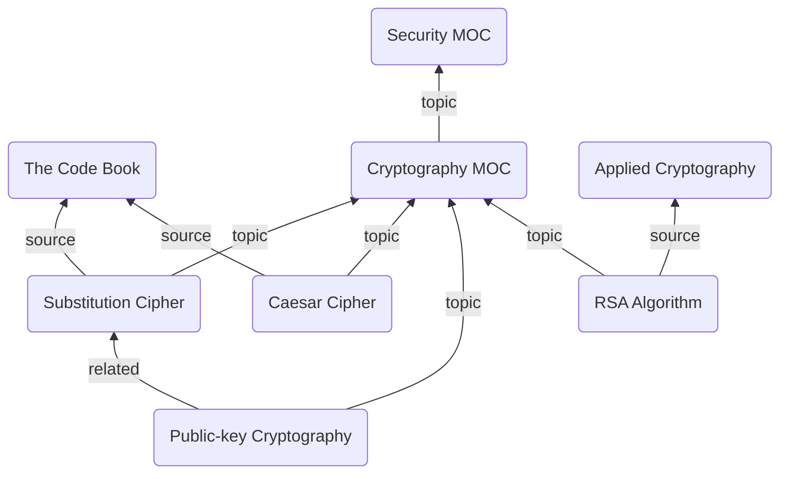
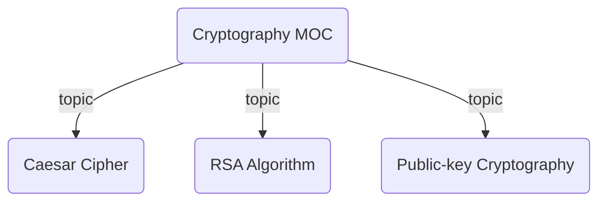

This guide will show you how to build a self-maintaining concept hierarchy for a Zettelkasten vault. The end result is a set of Map of Content (MOC) notes that automatically gather every note tagged with a given concept, render a live collapsible tree of all their children, and can produce a static table of contents on demand — all with zero manual linking.



There are various ways this structure can be achieved. The method in this guide uses three custom [Edge Fields](/edge-fields/) (`topic`, `source`, and `related`) to wire notes together, [Tag Notes](/explicit-edge-builders/tag-notes/) to auto-populate MOC notes with every note that carries a matching concept tag, and a [breadcrumbs codeblock](/views/codeblocks/) inside each MOC to render the living tree.

> [!NOTE]
> The `related` edges aren't shown in the full Mermaid graph above because they run horizontally between peers. They're still part of the schema and are used when you want to surface lateral connections inside a codeblock or the [Matrix View](/views/matrix-view/).

## Steps

### 1. Design Your Field Schema

We'll use three purpose-built fields rather than the generic defaults. Add the following under [Edge Fields](/edge-fields/) in `Settings > Edge Fields`:

- `topic`: Points **up** from a concept note to its MOC
- `source`: Points **up** from a concept note to the book, paper, or resource it came from
- `related`: Points **same** from a concept note to a peer concept at the same level

When you add each field, assign it to the appropriate [field group](/field-groups/):

| Field | Direction | Group |
|-------|-----------|-------|
| `topic` | up | `ups` |
| `source` | up | `ups` |
| `related` | same | `same` |

> [!TIP]
> Keeping `topic` and `source` both in the `ups` group means views and codeblocks that target the `ups` group will surface both types of upward relationship without extra configuration.

### 2. Add Fields to Your Concept Notes

Each atomic concept note gets a `topic` field pointing up to its MOC, and optionally a `source` field pointing to the resource it came from. Use [Typed Links](/explicit-edge-builders/typed-links/) in the frontmatter:

**Concepts/Caesar Cipher.md**

```md
---
topic: "[[Cryptography MOC]]"
source: "[[The Code Book]]"
tags:
  - cryptography
  - classical-cipher
---

The Caesar cipher shifts each letter in the plaintext by a fixed number of positions...
```

**Concepts/RSA Algorithm.md**

```md
---
topic: "[[Cryptography MOC]]"
source: "[[Applied Cryptography]]"
tags:
  - cryptography
  - public-key
related: "[[Public-key Cryptography]]"
---

RSA is an asymmetric cryptographic algorithm based on the difficulty of factoring...
```

[Rebuild the graph](/commands/rebuild-graph/), open the [Matrix View](/views/matrix-view/) on `Cryptography MOC`, and confirm that `Caesar Cipher` and `RSA Algorithm` both appear as children via `topic`.

### 3. Auto-link with Tag Notes

Manually adding a `topic` field to every new note works, but there's a lower-friction alternative: [Tag Notes](/explicit-edge-builders/tag-notes/). Turn your MOC note into a Tag Note and Breadcrumbs will scan your entire vault for notes carrying a matching tag and automatically build edges down to all of them — no frontmatter link required on the child.

Add the following to the frontmatter of your MOC:

**Cryptography MOC.md**

```yaml
---
BC-tag-note-tag: "#cryptography"
BC-tag-note-field: "topic"
topic: "[[Security MOC]]"
---
```



Now any note tagged `#cryptography` is automatically a child of `Cryptography MOC` via the `topic` field. When you create a new concept note and add the tag, it appears in the tree the next time Breadcrumbs [rebuilds the graph](/commands/rebuild-graph/) — no manual linking needed.

> [!NOTE]
> By default, Breadcrumbs matches nested tags too: a note tagged `#cryptography/classical` will still be picked up by the `#cryptography` Tag Note. Add `BC-tag-note-exact: true` to the MOC frontmatter if you only want exact matches.

> [!TIP]
> You can combine both approaches. Leave the `BC-tag-note` fields on the MOC for tag-driven membership, and still add explicit `topic` links in individual notes when you want to override or supplement the tag-based hierarchy.

### 4. Add a Live Tree Codeblock to Each MOC

A [breadcrumbs codeblock](/views/codeblocks/) inside the MOC note renders a live, collapsible list of everything below it. Paste the following into `Cryptography MOC.md`:

````md
```breadcrumbs
type: tree
fields: [topic]
collapse: true
sort: basename asc
```
````

This traverses all `topic` edges pointing down from the current note and renders them as a nested, collapsible markdown list. Every time you open the note (or [rebuild the graph](/commands/rebuild-graph/)), the list reflects the current state of your vault.

#### Limiting Depth

Use the `depth` parameter to control how many levels of the hierarchy are shown.

**Direct children only** — useful when a MOC has sub-MOCs and you only want to see the top level:

````md
```breadcrumbs
type: tree
fields: [topic]
depth: [0, 0]
collapse: true
sort: basename asc
```
````

**Full subtree** — traverses all the way down through nested MOCs:

````md
```breadcrumbs
type: tree
fields: [topic]
sort: basename asc
```
````

Omitting `depth` entirely shows all depths, which is equivalent to `depth: [0]`.

> [!TIP]
> `depth: [0, 0]` is particularly useful in a top-level hub note (e.g. `Home.md`) where you want to list only the first-level MOCs without pulling in every leaf note underneath them.

### 5. Use Field Groups in the Codeblock

Rather than listing individual fields, you can reference a [field group](/field-groups/) with `field-groups`. If you later add a new "downward" field to the same group, all your codeblocks pick it up automatically.

````md
```breadcrumbs
type: tree
field-groups: [downs]
collapse: true
sort: basename asc
```
````

This is especially handy if your MOC hierarchy grows and you introduce a sub-field like `subtopic` alongside `topic` — just add `subtopic` to the `downs` group and every MOC codeblock expands to include it.

### 6. Generate a Static Table of Contents

The live codeblock updates automatically, but sometimes you need a **static** snapshot — for export, sharing, or archiving. The [Create List Index](/commands/create-list-index/) command handles this.

1. Open a MOC note (e.g. `Cryptography MOC.md`)
2. Run the command palette (`Cmd/Ctrl + P`) and search for **"Create List Index"**
3. Choose your field group (`downs`) and sort order
4. The command copies the nested list to your clipboard

An example result:

```md
- [[Public-key Cryptography]]
  - [[RSA Algorithm]]
  - [[Diffie-Hellman Key Exchange]]
- [[Classical Ciphers]]
  - [[Caesar Cipher]]
  - [[Vigenère Cipher]]
```

> [!TIP]
> The output format is compatible with [List Notes](/explicit-edge-builders/list-notes/), so you can paste it directly into a note and use it as a List Note edge source. This gives you a manually-curated fallback if you ever want to lock in a particular ordering.

## Extras/Advanced Usage

### Nesting MOCs

MOCs themselves can point `topic` up to a parent MOC, creating a multi-level hierarchy. The Tag Note on the parent simply uses a broader tag:

**Security MOC.md**

```yaml
---
BC-tag-note-tag: "#security"
BC-tag-note-field: "topic"
---
```

Tag `Cryptography MOC.md` with `#security` and it becomes a child of `Security MOC`. The codeblock in `Security MOC` will then show the full subtree — MOCs and their leaves — when no `depth` limit is set.

### Surfacing `related` Peers

Add a second codeblock to any MOC to show lateral connections between its children:

````md
```breadcrumbs
type: tree
fields: [related]
depth: [0, 0]
show-attributes: [field]
sort: basename asc
```
````

This lists each note that has a `related` edge, one level deep, so you can quickly see which concepts are explicitly connected to one another without traversing the whole graph.

### Visualising the Full Sub-graph as Mermaid

Swap `type: tree` for `type: mermaid` to see a graph diagram of your concept cluster:

````md
```breadcrumbs
type: mermaid
fields: [topic, related]
merge-fields: true
show-attributes: [field]
```
````

Setting `merge-fields: true` means paths through both `topic` and `related` edges are shown in a single unified diagram, giving a complete picture of both the hierarchy and the lateral connections.
