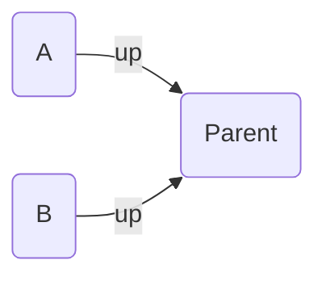
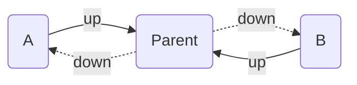
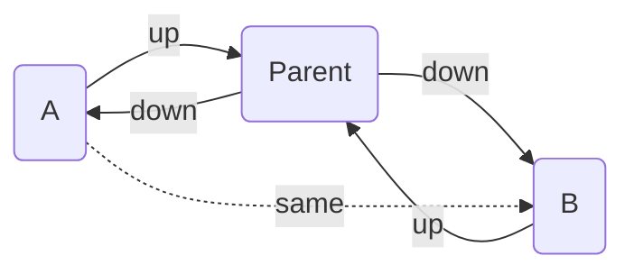

By default, each of your [Transitive Implied Relations](../transitive-implied-relations/) runs once, meaning they only consider the [explicit](/explicit-edge-builders/) edges in the graph when deciding if the rule matches. But in some cases, you may want the implied rule to consider _other implied edges_, that's where **rounds** come in:

- Setting rounds to `0` disables the rule.
- Setting it to `1` will run the rule once, only considering _explicit_ edges.
- Setting it to `2` will run the rule again, considering _explicit_ edges and _previously added_ implied edges.
- The maximum is `10`. New rules you add default to this max; the five built-in rules ship at `1`.

:::tip[TIP]
You can think of increasing the rounds as making all _previous_ implied relations **explicit**.
:::

## Example

Say you have the following explicit edges (two notes pointing `up` to their parent):

If you have the [Parent's Child is Sibling](../transitive-implied-relations/#parents-child-is-sibling) implied relation enabled, you may expect `A` and `B` to be marked as siblings, since they share the same parent. But in this example, they won't since there isn't a chain of `[up, down]` between the two. Instead, they both point `up`. To achieve the same effect, we can use the [opposite direction](../transitive-implied-relations/#opposite-direction) implied relation to add the `down` edges we need:

Now there is a chain of `[up, down]` between `A` and `B` (`A -up-> Parent -down-> B)`. But, because the `down` edge is implied, we have to increase the _rounds_ of the Parents' Child is Sibling relation to `2` to detect it. If it was only on `1`, then it wouldn't consider the implied edges added by the Opposite Direction relation.

