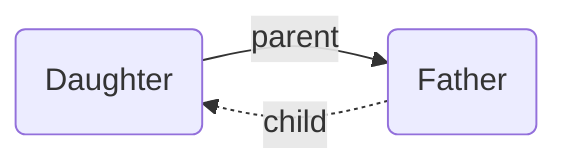

---
aliases:
  - implied
title: Implied Edge Builders
---

By [adding edges](/explicit-edge-builders/explicit-edge-builders/) to the Breadcrumbs graph, you've created various _explicit_ relationships: "Note A is the _parent_ of note B", or "note C has 3 _children_: D, E, and F". But this also _implies_ some relationships. For example, if `Father` is the _parent_ of `Daughter`, then it's _implied_ that `Daughter` is the **child** of `Father`!

## Rule Kinds

Currently, all implied relationships are added in the same way, using _transitive chains_ of [explicit](/explicit-edge-builders/explicit-edge-builders/) edges:

- [Transitive Implied Relations](transitive-implied-relations/)
