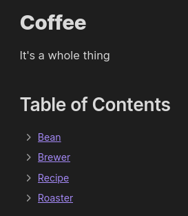
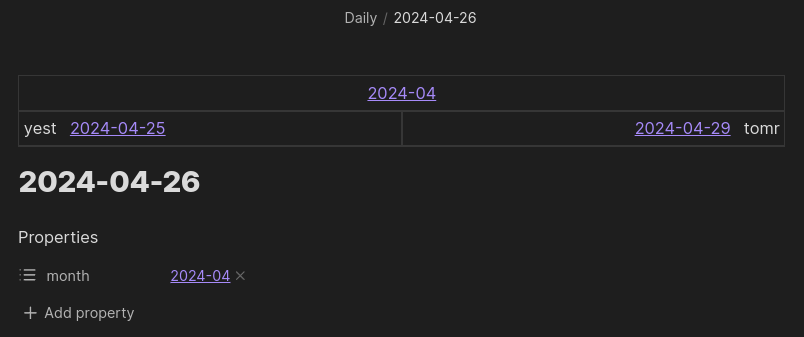
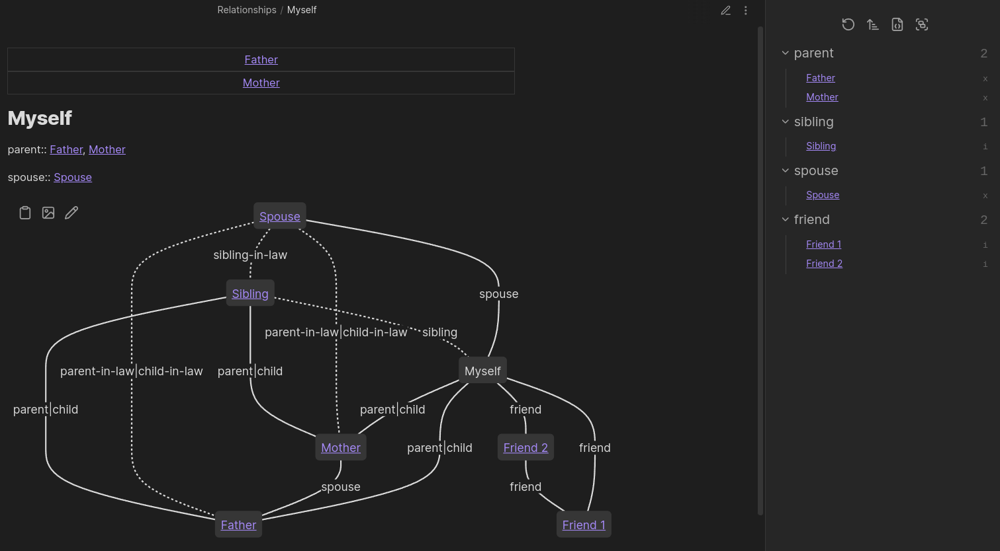

Welcome to the Breadcrumbs docs 🍞 Here you can find more detailed explanations of the various functions of the Obsidian [Breadcrumbs plugin](https://github.com/michaelpporter/breadcrumbs).

:::note[INFO]
Breadcrumbs lets you add _typed links_ to your notes. You supply the structure, Breadcrumbs helps you leverage it.
:::

:::caution[REQUIREMENTS]
Breadcrumbs 4.15.0+ requires **Obsidian 1.13.0 or later**. Still on Obsidian 1.12? Stay on Breadcrumbs 4.14.2 — the 1.12 line is maintained on the [`1.12-compat`](https://github.com/michaelpporter/breadcrumbs/tree/1.12-compat) branch.
:::

## What's New

| Date | Version | Change |
| ---- | ------- | ------ |
| 2026-06-17 | [4.19.0](/announcements/announcement-2026-06-17-v4190/) | Removed the `type: graph` codeblock; case-insensitive `from`; faster codeblock traversal |
| 2026-06-07 | [4.15.0](/announcements/announcement-2026-06-07-v4150/) | Requires Obsidian 1.13; searchable, reorganised settings tab |
| 2026-06-03 | [4.14.1](/announcements/announcement-2026-06-03-v4141/) | Tree View: notes with multiple parents now appear under each parent |
| 2026-06-02 | [4.14.0](/announcements/announcement-2026-06-02-v4140/) | Dataview no longer required; native inline fields; `self_is_sibling` setting |

## Use-cases

**Auto-generated Table of Contents**

**Speedy navigation between related notes**

**Visualise Complex Hierarchies**

## Quick Start

To quickly see one way Breadcrumbs works, you can do the following:

- Install & enable Breadcrumbs
- Open a new note
- Add `up: [[note]]` as a metadata Properties field
	- [Dataview](http://blacksmithgu.github.io/obsidian-dataview/) inline fields work too `up:: [[note]]`
- Run the "**Breadcrumbs: [Rebuild Graph](/commands/rebuild-graph/)**" command to refresh the Breadcrumbs graph
- Then run the "**Breadcrumbs: Open [Matrix View](/views/matrix-view/)**" command
	- See how the Matrix View shows a link pointing "_up_" to `[[note]]`

In the terminology of Breadcrumbs, you've just used the "[typed-link](explicit-edge-builders/typed-links/)" edge builder to add an [explicit edge](explicit-edge-builders/) from one note to another, using the `up` [edge field](/edge-fields/).

## Practical Value

Breadcrumbs gives the following benefits:

- Automatic linking via [Explicit Edge Builders](explicit-edge-builders/) and [Implied Edge Builders](/implied-edge-builders/)
- Convenient navigation using the [Views](/views/) and some [Commands](/commands/)
- Visualing paths of links, also using the [Views](/views/)

## Overview

### Setup

- Setup your [Edge Fields](/edge-fields/) so that Breadcrumbs know metadata properties you use
	- Breadcrumbs comes with 5 generic edge fields, but you can customise these as needed
- Add structure to your notes using the various [Explicit Edge Builders](explicit-edge-builders/)
	- Some builders are manual, while others can automatically use your existing structure (including your tags, folders, links, etc.)
- Fill in the gaps with the [Implied Edge Builders](/implied-edge-builders/)
	- Breadcrumbs can _infer_ more complex relationships from the initial edges
	- You have full control over the rules for adding implied edges
- Use the [Views](/views/) to see your fields in action
	- These general run a [graph traversal](concepts/#traversal) and present the results in some way
- Try out the [Commands](/commands/) to do other useful stuff
	- Quickly jump to neighbouring notes, summarise your graph, "freeze" implied edges to your notes for future-proofing
