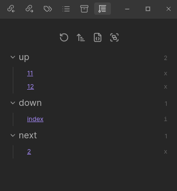

The _Matrix View_ appears on the side of the editor, and shows the **immediate outgoing neighbours** of the current note, grouped by their [field](/edge-fields/).

On the right side of each link, you'll see an `x` or `i`, indicating if that edge is [explicit](/explicit-edge-builders/) or [implied](/implied-edge-builders/). Hover over the icon to see the [source](/concepts/#edge-attributes) of real edges, and the [kind](/concepts/#edge-attributes) of implied edges (as well as the [round](/implied-edge-builders/implied-relation-rounds/) they were added in).

## Settings

Change under `Settings > Views > Matrix`:

- **Collapse**: Collapse each group of fields by default
- **Custom Field Sorting**: When enabled, sort the field groups in the matrix by a custom order you define
- **Field Order**: (Visible when Custom Field Sorting is on) Set the exact order in which [edge fields](/edge-fields/) appear in the matrix
- **Sort**: Change the [edge sorter](/concepts/#edge-sorters) used for the items within each field group
- **Show Attributes**: Choose which [edge attributes](/concepts/#edge-attributes) show (when hovering the `x`/`i` icon)
- **Field Groups**: Choose which [field groups](/field-groups/) are shown
- **Lock View**: Lock the matrix view to a specific file, so it doesn't change as you navigate
- **Lock Path**: The file path to lock the matrix view to (overrides the current note)
- **Note Display Options**: Three toggles — **Folder**, **Extension**, and **Alias** — that control how note links are displayed in the matrix

## Search

A fuzzy search input in the Matrix View toolbar filters displayed notes by title. Fields with no matching notes are hidden. Click the search icon in the toolbar to toggle it.
