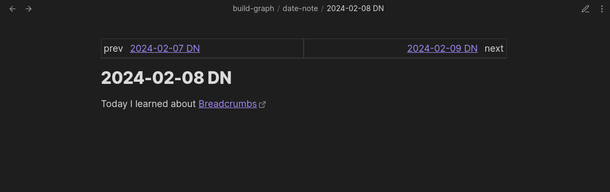

The Previous-Next View shows the immediate `previous` and `next` neighbours of the current note.

A common use-case for this view is to see your Daily Notes for `yesterday` and `tomorrow` from the current note. See the [Layered Daily Notes](/guides/layered-daily-notes/) guide for more details on this example.

## Settings

Change under `Settings > Views > Page > Previous/Next`

- **Enable**: Show/hide the Previous/Next View at the top of your notes
- **Field Groups for Left**: Choose which [field groups](/field-groups/) are shown on the _left_ (previous) side of the view. Defaults to the `prevs` group.
- **Field Groups for Right**: Choose which [field groups](/field-groups/) are shown on the _right_ (next) side of the view. Defaults to the `nexts` group.
- **Note Display Options**: Three toggles — **Folder**, **Extension**, and **Alias** — that control how note links are displayed in the view.

### Period Rows

When using [Date Notes](/explicit-edge-builders/date-notes/), you can optionally show extra rows in the Previous/Next View for larger time periods. Each row shows the `previous`/`next` neighbour for that period from the current note's date.

- **Week**: Show a week-period row
- **Month**: Show a month-period row
- **Quarter**: Show a quarter-period row
- **Year**: Show a year-period row
