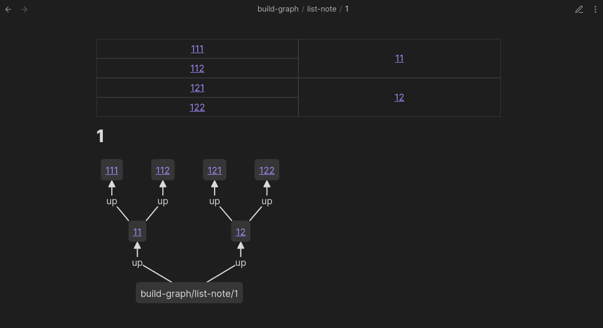
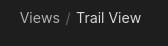

The Trail View shows all paths going _up_ from the current note. In this example, we see a binary tree going up two levels from the current note. The [Mermaid graph](../codeblocks/) below visualises the same data:

<!-- TODO: Get a narrower link to Mermaid graph. Currently it's just to [Codeblocks](../codeblocks/) -->

:::tip[!IMPORTANT]
Read the Trail View from right-to-left. The right-most notes are the immediate neighbours of the current note. As you move further left, the notes get further away from the current note. Similar to how the File Explorer shows your current folder path from highest-to-lowest:

 
:::

## Settings

Change under `Settings > Views > Page > Trail`

- **Enable**: Show/hide the Trail View at the top of your notes.
- **Format**: Show the results in a `path` or `grid` format (the underlying data is still the same). <!-- TODO: Show example image -->
- **Path Selection**: Show `all` paths, or only the `shortest`/`longest` path.
- **Default Depth**: A maximum _depth_ of the paths. If the paths go longer than the max depth, they are sliced off. Defaults to `999` (effectively unlimited).
- **Field Groups**: Choose which [field groups](/field-groups/) are shown. By default, the `ups` group is shown.
- **Merge Fields**: [Traverse](/concepts/#traversal) each [field](/edge-fields/) separately, or all together.
- **Show Controls**: Show/hide a set of controls on top of the Trail View to change the format, depth, and path selection interactively.
- **No Path Message**: The message to show when there are no paths to display. Leave blank to hide the Trail View entirely when there is no path.
- **Note Display Options**: Three toggles — **Folder**, **Extension**, and **Alias** — that control how note links are displayed in the trail.
