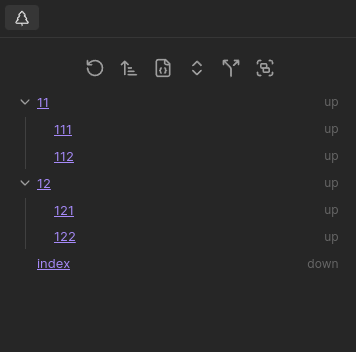

The Tree View appears on the side of the editor, and shows all paths with a chosen [field group](/field-groups/), starting from the current note. By default, it shows all paths going `down`. This image shows paths going either `up` or `down`:

## Settings

Change under `Settings > Views > Tree`

- **Collapse**: Fold the nested paths by default
- **Edge Sort**: Change the [edge sorter](/concepts/#edge-sorters) used
- **Show Attributes**: Choose which [edge attributes](/concepts/#edge-attributes) show
- **Field Groups**: Choose which [field groups](/field-groups/) are shown
- **Merge Fields**: [Traverse](/concepts/#traversal) each [field](/edge-fields/) separately, or all together
- **Lock View**: Lock the tree view to a specific file, so it doesn't change as you navigate
- **Lock Path**: The file path to lock the tree view to (overrides the current note)
- **Find Root**: When enabled, the tree always starts from the root of the hierarchy (walking up via the configured field groups), rather than from the current note
- **Find Root Field Groups**: The [field groups](/field-groups/) used to walk up to the root when **Find Root** is enabled. Defaults to `ups`
- **Note Display Options**: Three toggles — **Folder**, **Extension**, and **Alias** — that control how note links are displayed in the tree
